# ZK Rollup on Bitcoin: Technical Whitepaper v0.8.5

# **1 Introduction**

Satoshi Nakamoto’s discovery of how to prevent double-spending without a trusted third party gave birth to Bitcoin [1]. Implemented as a peer-to-peer network on the Internet, Bitcoin is a global, decentralized settlement system with a native digital currency. After widespread adoption in the subsequent years, bitcoins are the most valuable digital currency by global market cap.

This success comes not only from being the first decentralized digital currency, but also from the unrelenting ethos of the Bitcoin community towards prioritizing decentralization and security. The Bitcoin blockchain is designed to be limited in scalability and programmability to ensure that it is sufficiently decentralized and secure. These tradeoffs enable Bitcoin to be the most secure, censorship-resistant settlement layer with a native currency free of counterparty risk.

One of the major costs in these tradeoffs is that there are limited applications of this digital currency secured by the Bitcoin network beyond peer-to-peer payments. Even for the payments application, stringent latency and throughput limitations make Bitcoin unsuitable for low-value, high-volume instant payments.

With the growing adoption of bitcoins as a digital currency, there is an increased demand for using bitcoins across many other financial applications like private payments [2], derivative trading [3], vault storage [4], lending [5], and more. Unlike peer-to-peer payments, these applications cannot be supported directly on-chain using advanced smart contracts due to Bitcoin’s limited scalability and programmability.

To use bitcoins for these other financial applications, people commonly use centralized services with custodial wallets. The volume processed by centralized service providers is large [6], but this option presents significant third party risks for users, repeatedly leading to lost or stolen funds [7] [8] [9] [10]. Alternatively, people use decentralized applications on alternative blockchains like Ethereum [11] or Liquid Network [12], but this requires transferring bitcoins across a trusted bridge — controlled by third parties on a multisig address — to the alternative blockchain. While this approach is relatively more secure than centralized services, there is still significant risk from a trusted bridge [13] and requires additional trust assumptions from the alternative blockchain’s consensus protocol.

To support other financial applications for bitcoins with advanced smart contracts, we first need a transaction execution environment that includes persistent storage, account abstraction, expressive smart contract language, and offers high throughput and low latency. This execution environment cannot exist on Bitcoin, as that would add significant complexity and compromise the blockchain’s security. However, if Bitcoin nodes could efficiently validate the computational integrity of programs executed in off-chain environments without executing any of those programs themselves, then it could be possible to secure decentralized financial applications using Bitcoin as the settlement layer. Most importantly, this could be done without bringing any transaction execution complexity on-chain. Recent advances in zero-knowledge proof systems [14] [15] provide practical, post-quantum secure cryptographic primitives for succinctly verifiable general computation.

We use this insight to propose a new Layer 2 on Bitcoin that adds significant expressivity and scalability to bitcoin transactions without introducing any transaction execution complexity on Bitcoin. Our proposed Layer 2 guarantees users full ownership, control, and ability to unilaterally withdraw back any funds they deposit into the Layer 2. Importantly, this guarantee is provided without requiring any additional trust assumptions beyond the ones already required by Bitcoin.

Our proposed Layer 2 is a ZK Rollup System, which uses proofs of computational integrity to verify the validity of L2 transactions and corresponding L2 state changes directly on Bitcoin. While the idea of using proofs of computational integrity to securely scale and extend the capabilities of Bitcoin was proposed as early as 2013 by Greg Maxwell [16], the recent improvements of this technology — such as orders of magnitude improvements in computation time [17] and novel proof schemes that do not require trusted setups — make its use practical today.

In the next section, we discuss other Bitcoin infrastructure work also aimed at enabling more decentralized use cases for bitcoins, including Lightning Network and sidechains. We also discuss existing validity rollups and optimistic rollups on other blockchain ecosystem. Section 3 provides a general introduction to validity rollup architectures. Section 4 covers our major contribution in this paper, which is a technical design of our proposed ZK Rollup System on Bitcoin. In Section 5, we provide a technical overview of zero knowledge proofs and describe properties of a proof system employed in our ZK Rollup design for Bitcoin compatibility.

# **2 Related Work**

In this section, we describe several existing work related to scaling and extending the capabilities of Bitcoin. We discuss their goals, technical constructions, practical tradeoffs, and current limitations. Additionally, we provide a general description of rollups and provide an overview of existing work on rollups in other blockchain ecosystems.

## **2.1 Lightning Network**

Lightning Network [18] is a payment layer on Bitcoin proposed in 2015 that enables faster and cheaper bitcoin transactions on a network of interconnected, bidirectional payment channels. As a Layer 2 protocol, Lightning Network aims to improve transaction throughput and latency for peer-to-peer payments without introducing additional trust assumptions.

Payment channels are protocols that allow two parties to securely transact bitcoins without settling every transaction on Bitcoin. Typically, two parties open a payment channel with an on-chain funding transaction and close a payment channel with an on-chain settlement transaction, but while the payment channel is open they can create many intermediate off-chain transactions with each other. Since off-chain transactions are not bound to the constraints of the Bitcoin blockchain, a payment channel lets users make large number of instant transactions using their on-chain deposits.

Several payment channel protocols were designed and implemented for Bitcoin earlier than 2015 [19] [20], but these were limited, disconnected payment channels. Lightning Network improved the prior art by introducing Hashed Timelock Contracts (HTLCs) and a new bidirectional, trustless payment channel protocol. This construction led to a payment network of participants connected through bidirectional payment channels secured on Bitcoin.

While Lightning Network provides scalability improvements, this channel-based Layer 2 solution has inherent limitations that make non-custodial usage very onerous. To transact on the Lightning trustlessly, users must have a Lightning node with at least one payment channel connected to another node on the network. To send or receive funds, the user’s node must have sufficient outbound and inbound liquidity, respectively, locked up in one of its payment channels. For example, to receive 100,000 sats, the user’s node must already have at least 100,000 sats locked up as inbound liquidity on one of its payment channels. In addition to the liquidity overhead, each node on the network must maintain recurring backups and meet liveness requirements for basic security. At any point, the counterparty in a payment channel can unilaterally close the channel with an older channel balance; to prevent this counterparty risk, Lightning nodes must be online and persistently monitoring Bitcoin to counter these fraudulent transactions.

Beyond these inherent limitations, there are also salient implementation issues affecting Lightning today. One issue is that a significant number of payment channels in the network are unbalanced. Since liquidity balances on payment channels are not visible on the network, a sender may need to attempt routing through multiple connected routes to the receiver before a valid route with sufficient liquidity is found. This causes a delay or failure in completing the transaction, leading to significant payment unreliability. Additional unresolved issues involve channel jamming [21], pinning attacks [22], and efficient channel rebalancing [23].

With the industry adoption of and investments in the Lighting Network [24], we believe these implementation issues are resolvable over time. However, given the recurring operational and capital overhead of maintaining a self-custodial node inherent to the Lightning architecture, we believe most users will rely on a trusted third party for Lightning payment processing.

## **2.2 Sidechains**

Sidechains were introduced by Back et al. in 2014 with the goal of enabling new use cases of bitcoin currency without increasing complexity on the Bitcoin blockchain [25]. The core idea was to enable users to securely move bitcoins to and from another blockchain (sidechain). A sidechain can have a different set of features from Bitcoin like a more expressive smart contract language or a bigger block size; this allows a sidechain to support a broader set of applications. Figure 1 shows the general construction of a sidechain.

<p align="center">
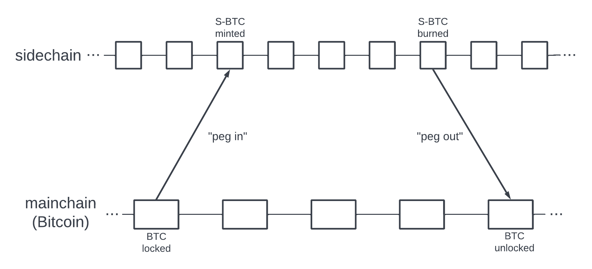
</p>

_Figure 1. A sidechain is a separate blockchain that has a different set of features and protocols from Bitcoin. Users lock bitcoins (BTC) on the mainchain — typically to a multisig address controlled by third parties — and an equivalent amount sidechain bitcoins (e.g. “S-BTC”) are minted on the sidechain. Users can then transact their S-BTC on the sidechain, secured by the sidechain’s own consensus protocol. When ready to withdraw their S-BTC funds back to Bitcoin, users can request a withdrawal. Once the withdrawal is approved by some trusted third parties, their S-BTC on the sidechain are burned and an equivalent amount of BTC are unlocked on the mainchain._

Since 2014, there have been several Bitcoin sidechains proposed with varying designs for securing the two-way peg, achieving consensus on the sidechain blocks, and the functionality offered on the sidechain. Liquid Network [26] uses federated multi-sig to both secure the peg and create new blocks, and offers new functionality like Confidential Transactions. RootStock (RSK) uses an improved federated multi-sig model [27] to secure the peg, merged mining to create new blocks, and can execute expressive smart contracts with its Turing Complete RVM and persistent storage [28]. Drivechain [29], not yet in production, proposes improvements to securing the two-way peg using hash rate escrows [30] and achieving consensus on the sidechain using blind merged mining [31].

While existing sidechains extend the applications of bitcoins without adding significant complexity or risk to Bitcoin itself, they demand significant trust assumptions from users. For Liquid and RSK, users cannot withdraw their sidechain assets back to Bitcoin without permission from the respective federated multisig. At any point, entities in these multisigs could collude or get compromised, resulting in stolen or frozen assets on the sidechain. Drivechain, which can be implemented on mainnet after a Bitcoin soft-fork, improves this with a permissionless two-way peg, but users have to wait at least three months to complete any withdrawal back to Bitcoin. Additionally, users must trust that majority of Bitcoin miners will not collude to steal their pegged assets. This is different from Bitcoin’s existing risk, where a majority of Bitcoin miners can collude to double spend only their own assets.

Wrapped bitcoins like WBTC [11] and SoBTC [32] follow a similar 2-way peg construction: users make deposits to multisig addresses on Bitcoin to receive wrapped bitcoins on other blockchains. In the case of WBTC, nearly 200,000 bitcoins are currently held by a custodian on Bitcoin for a one-to-one collateral of WBTC minted on Ethereum. There are many applications of WBTC on Ethereum, particularly in DeFi protocols like Uniswap [33] and Aave [34]. Users must trust the centralized custodian to remain solvent with sufficient collateral to be able to withdraw their assets back to Bitcoin. This design presents a significant risk for users, as exposed when users were not able to redeem soBTC back to bitcoins after the FTX collapse in November 2022 [32].

Bitcoin sidechains today require a trusted and mostly permissioned two-way peg, leading to centralized points of failure and user risks. Additionally, sidechains introduce additional trust requirements for the user with their consensus protocols. While the mechanics to enforce the two-way peg and achieve consensus on the sidechain have become more secure over time, holding assets on any Bitcoin sidechain today still requires significant trust assumptions beyond Bitcoin’s consensus protocol.

## **2.3 Rollups**

Rollups are scaling solutions that involve processing a batch of transactions off-chain and settling the batch as a single transaction on-chain. Rollups enable validators on the blockchain to efficiently verify the validity of multiple transactions without having to execute them on-chain. This reduces on-chain computation overhead and storage footprint for transactions, leading to better throughput and lower costs. Beyond the scalability benefits, rollups can also extend the functionality of a blockchain because off-chain execution environments can process more complex transactions.

The off-chain rollup system can be a Layer 2 (L2) blockchain with block producers that verify transactions and broadcast state changes to the L1 blockchain. Each L2 block is settled only once the state transition is confirmed to be valid on the L1 blockchain. This construction enables the L2 blockchain to use L1 consensus for both securing the two-way bridge between L1 and L2 and confirming new L2 blocks. There are different techniques to ensure the validity of L2 state transitions in the L1 rollup protocol, resulting in two types of rollups: _optimistic_ rollups and _validity_ rollups.

In an optimistic rollup, L2 block producers broadcast transaction data to an on-chain rollup contract and stake some funds to vouch for the validity of those off-chain transactions. These off-chain transactions are assumed to be correct unless proven otherwise. Anyone can submit a fraud proof within a fixed challenge period (typically one week) to report an invalid transaction. Invalid transactions can result in the block producer losing their stake, therefore creating economic incentives to submit correctly verified transaction data. Early ideas of optimistic rollups go back to 2014 with Vitalik Buterin’s Shadow Chain [35], but today there are several active optimistic rollup L2 systems like Arbitrum [36] and Optimism 37] deployed on Ethereum. The main drawbacks to this type of rollup are long settlement times for L2 state transitions and persistent overhead on users to audit and potentially challenge the validity of off-chain transactions.

Unlike optimistic rollup which is secured by cryptoeconomic guarantees, a validity rollup uses a formal system of cryptographic proofs to secure off-chain transactions. Validity rollup construction requires L2 block producers to provide a validity proof attesting to the correctness of transaction execution and the resulting state updates. Validity proof, which is a proof of computational integrity, is provided along with a compressed summary of L2 state changes to an L1 smart contract for verification. This enables the L2 transactions to be secured by L1 consensus protocol without introducing any L2 transaction execution complexity to L1. Deposits to and withdrawals from L2 are also secured by L1 validators, enabling a trustless bridge between the two layers.

The first construction of a validity rollup was proposed in 2019 by Barry Whitehat [38], which used SNARK proof to secure basic off-chain transactions on Ethereum. Since then, many other rollup constructions have been designed and deployed on the Ethereum blockchain. Initial ZK rollups only supported specific use cases like payments without general smart contract capabilities [39], but more recent ZK rollups support Turing-complete smart contracts using general purpose zero-knowledge compatible virtual machines [40] [41] [42].

On Bitcoin, there has been relatively little progress on validity rollup designs, partly because L2 cannot be implemented without changes to the base layer. John Light created a comprehensive report in 2022 that examined the potential for validity rollups on Bitcoin [43]. He concluded that validity rollups would be a great fit for scaling and extending the capabilities of Bitcoin in a way that could be consistent with the community’s core values. Earlier that year, Trey del Bonis provided one of the first technical proposals for building a validity rollup on Bitcoin [44]. Our work builds on both of their prior work, and shares the conclusion that validity rollups could significantly improve Bitcoin infrastructure without compromising security and decentralization.

# **3 Introduction to Validity Rollups**

In this section, we describe the components of a general validity rollup architecture. This general overview is provided as context to our specialized ZK Rollup design presented in Section 4. A validity rollup construction involves the interaction of two systems: one on the base layer (L1) and another one in an off-chain rollup layer (L2). We refer to the system on L1 as “L1 Rollup Protocol” or “L1 Protocol” and the off-chain system as “L2 Rollup System” or “L2 System”. Together, the L1 Protocol and L2 System make up the validity rollup, as shown in Figure 2.

<p align="center">
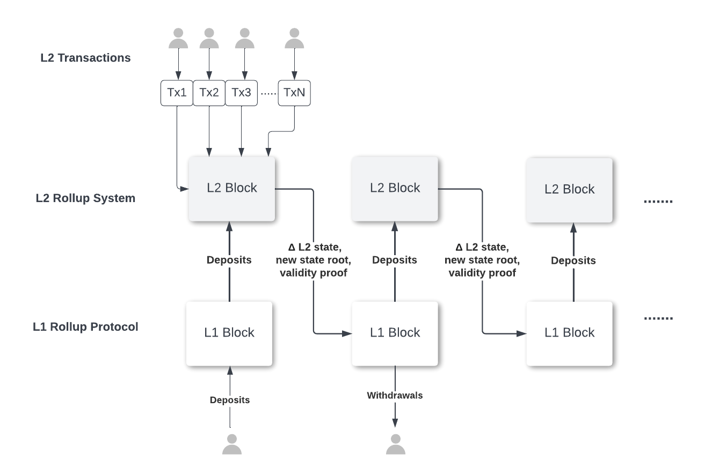
</p>

_Figure 2: L1 Protocol facilitates the deposits into and withdrawals from the rollup. L2 System executes the off-chain transactions and combines them into a block. It then rolls them into a single L1 transaction and posts it to L1 along with the new L2 State Root of the L2 State Tree and the validity proof of the Rollup State transition from the last verified L2 State Root. L1 Protocol verifies the validity proof, updates the Rollup State in L1, and includes the verified transaction in the next L1 block._

## **3.1 Overview**

An account-based validity rollup stores balances and relevant metadata in unique user accounts in the L2 System. Each account can be represented by a leaf in a Merkle Tree, as described in Section 3.2.1. Since the collection of all user accounts constitutes the state of the L2 System, the Merkle Tree of accounts is known as the _L2 State Tree_. The root of this tree is the _L2 State Root_, which is stored in L1 Protocol as a state commitment. After a batch of transactions is processed by the L2 System, the L2 State Tree is updated and a new L2 State Root is proposed to the L1 Protocol along with a cryptographic proof attesting to the validity of the state transition from the old L2 State Root to the new L2 State Root.

After the proof is validated on L1, the L1 Protocol updates the latest confirmed state commitment to the new L2 State Root. L2 System then adds that verified batch of transactions on its own blockchain, typically as a new block. The account changes between the last confirmed L2 State Tree and the newly confirmed L2 State Tree is stored on L1 for data availability. This enables anyone to construct the latest confirmed L2 State Tree without cooperating with the L2 System. As new user transactions get processed by the L2 System, subsequent batches are created and the entire process repeats.

To deposit funds into a rollup, users interact with L1 Rollup Protocol to create a deposit transaction. The L2 System processes those deposits and creates appropriate accounts in the L2 State Tree. These deposits are included in the next batch to be verified along with other L2 transactions. Unilateral withdrawals of funds from the L2 System are done similarly by users directly interacting with the L1 Protocol.

With an account on the L2 System, users can transfer their funds to other L2 accounts or withdraw back to any address on L1, though most transactions processed by the L2 System are transactions between L2 accounts. The L2 System's transaction execution environment can have a different set of features and support new types of transactions that are not available on L1.

To withdraw from the rollup, users typically submit a withdrawal transaction to the L2 System, which removes the desired funds from their accounts on L2. These withdrawal transactions are included in the next state update committment to the L1 Protocol. The L1 Protocol verifies the validity of the withdrawal transactions and approves the withdrawals of funds to appropriate addresses in L1.

If the L2 System censors any withdrawals from the rollup, users can unilaterally withdraw their rollup funds by only interacting with the L1 Protocol. The rollup has mechanisms to ensure that the user has the necessary funds in the latest confirmed L2 State Tree to withdraw. Furthermore, there is sufficient account data available on L1 for users to be able to construct the latest confirmed L2 State Tree without the cooperation of the L2 System.

The L1 Protocol often has additional rules to handle cases when the L2 System fails completely, does not cooperate, or does not submit any updates for a prolonged period of time. In addition, it may have rules for updating the protocol itself, or any other rules specific to the application.

## **3.2 Accounts and Balances Representation**

A Merkle tree data structure is often employed to store account data in an L2 Rollup System. This section describes the processes for storing, updating, and creating proof of account data in a Merkle tree.

### **3.2.1 Merkle Tree**

A Merkle tree is a balanced binary tree in which each leaf node stores the hash of the underlying data and each inner node up to the root stores the hash of a concatenated string of its children’s hashes. The Merkle root, in turn, is a hash that represents an accumulated hash of the entire dataset.

In the case of a rollup, each leaf stores account data for a user. Figure 3 shows a simple example with 4 users, where the account data is represented by a string of a user’s public key concatenated with the balance they hold in the rollup. More complex representations of account data are used in practice. Each account data A, B, C, and D is hashed as a Merkle leaf, and each parent node stores the hash of the concatenation of their children hashes. Thus, the root hash $H_{ABCD}$ is implicitly the hash of all user accounts in the tree, and used as a commitment to the state of the tree.

<p align="center">
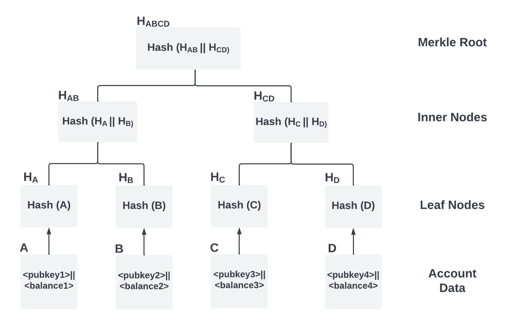
</p>

_Figure 3: A simple account Merkle tree of depth 2, with 4 user accounts. Each leaf is a hash of a user’s account data, and each internal node is a hash of concatenation of it’s two child hashes._

In a rollup, the entire accounts tree is stored in the L2 System whereas just the Merkle root is stored in L1 protocol as a commitment to the latest state of the tree. This approach is preferred as it is typically expensive to store data on the base layer. With just the root hash, L1 contract is able to verify the existence of account data provided by any user, given a Merkle proof for the account.

### **3.2.2 Merkle Proof**

Merkle proof is a way to prove the existence of a leaf in a Merkle tree without revealing or searching for the entire tree. Specifically, a Merkle proof is a list of hashes of appropriate nodes in the tree such that the root hash can be constructed from that list of hashes along with the leaf data. Such hashes are also called co-hashes.

Figure 4 shows an account tree with 8 user accounts, A through H (entire tree not shown). To prove the existence of account F, one needs to provide the account data information of F (or its hash $H_F$) and a list containing $H_E$, $H_{GH}$, and $H_{ABCD}$ (co-hashes). Using just these 3 hashes and the information of F, we can construct $H_{ABCDEFGH}$ by combining all these hashes in a prescribed way. This kind of Merkle proof is also called the inclusion proof, in that it proves the inclusion of data in a large dataset. A Sparse Merkle Tree allows for proof of non-inclusion in which one can prove the absence of certain data in the tree. This equates to the proof of inclusion of an empty leaf in a Sparse Merkle Tree.

<p align="center">
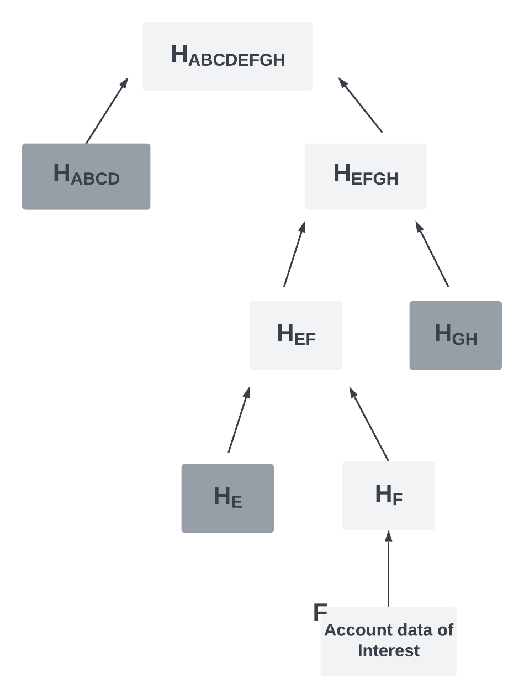
</p>

_Figure 4: For an account tree with 8 accounts, the co-hashes necessary for Merkle proof of account data F are shaded. Only $\textrm{O}(\log_2N)$ co-hashes are needed in a Merkle tree of N accounts. In this example, N=8 and only 3 co-hashes are necessary._

For a Merkle tree with N leaves, the size of the proof is proportional to the height of the Merkle tree which is $\textrm{O}(\log_2N)$. The number of hashes needed to verify the proof, hence the runtime complexity of the verification, is also $\textrm{O}(\log_2N)$.

In a rollup, Merkle proofs are usually presented by the user to L1 protocol during unilateral withdrawals or deposits to prove the existence or non-existence of their accounts respectively. L1 protocol constructs a root from the account data and the proof provided by the user, and compares it to the root stored in the protocol to check the validity of the proof.

### **3.2.3 Merkle Update**

A Merkle update is an update to a leaf in a Merkle tree. To update the data in a leaf, one can prepare a new leaf with the updated information and hash it. Then, using the hash of this new leaf and the list of co-hashes (similar to the Merkle proof list), one can progressively update the inner nodes and finally the Merkle root. The runtime complexity of a Merkle update is $O(log_2N)$ for a tree with N leaves, same as that of a Merkle proof verification.

Merkle update is used in rollups to update the account’s balance, to add new accounts, and to remove existing accounts. Therefore, Merkle update is an operation performed during the execution of all transactions in a rollup.

## **3.3 System Components**

Generally, a validity rollup construct consists of 4 core modules: a Rollup Coordinator, a Transaction Executor, a Prover, and a Rollup Protocol. The first three are part of the L2 Rollup System while the Rollup Protocol is on the base layer. Some rollup designs include Transaction Executor within either Prover or Rollup Coordinator, but we show it as a separate module in this paper for clarity.

<p align="center">
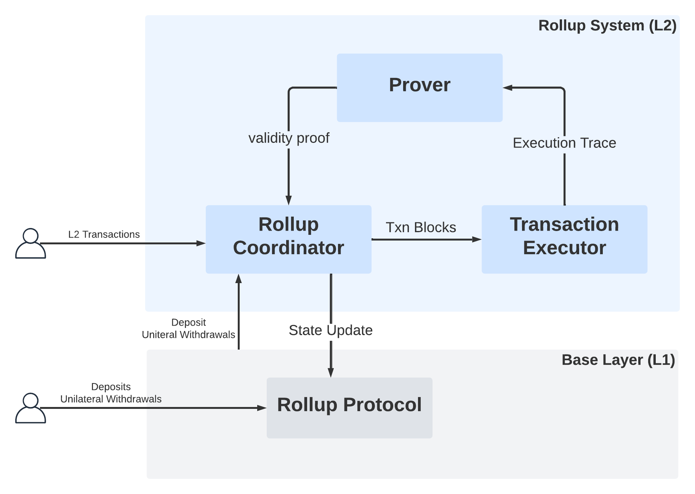
</p>

_Figure 5: System components in a general rollup architecture. A rollup coordinator batches transactions into a block, a Transaction Executor executes those transactions and passes the execution trace to a Prover which prepares a validity proof for the state transition. The Rollup Coordinator uses the validity proof and the compressed block data to construct a state update transaction on L1. The rollup protocol validates the state transition using the validity proof. It also processes the deposits and unilateral withdrawal transactions._

### **3.3.1 L1 Rollup Protocol**

L1 Rollup Protocol is the system on the base layer (L1) in a rollup. It handles at least three types of transactions: _deposit_, _unilateral withdrawal_, and _L2 state update_. Deposit and unilateral withdrawal are submitted by the users while the L2 state update is submitted by the L2 Rollup System.

When a user submits a deposit transaction, the rollup protocol locks the user funds into the rollup and tracks the deposit as “pending”, along with other pending deposits. This information remains in L1 until L2 Rollup System adds these deposits to their respective accounts in the next proposed L2 block and that block is verified by L1 Rollup Protocol to be consistent with the pending deposits so far. This ensures that the deposited funds are properly transferred from L1 to L2.

If a user wants to unilaterally withdraw their rollup funds without interacting with the L2 Rollup System, they submit a unilateral withdrawal transaction. This requires a user to provide a proof of their account and balance to the rollup protocol, often using a Merkle proof. The L1 Rollup Protocol verifies the proof against the latest state commitment of the L2 State Tree stored in L1 and approves the withdrawal.

The L2 Rollup System submits a state update transaction to propose to L1 Rollup Protocol a new state commitment obtained after executing a batch of transactions. The proposed state commitment is accompanied by the validity proof of the valid state transition from the last verified commitment to the new proposed commitment. The rollup protocol verifies the validity proof, validates that the new (pending) deposits being tracked by the L1 Rollup Protocol are included in this proposed batch, ensures that the new withdrawals in the batch are being directed to the authorized users, and updates the state commitment to the new proposed one. This state update transaction is at the heart of a validity rollup construction because it is the construct that allows large number of user transactions to be “rolled up” into one, saving computational resources of validators on the base chain.

### **3.3.2 L2 Rollup System**

An L2 Rollup System is typically a blockchain system that accepts L2 transactions, collects them into a block, updates the Rollup State, and generates a validity proof of the state transition. It then communicates the new state and all the account changes leading up to the new state to the base layer.

There are usually three components that handle the above functions: Rollup Coordinator, Transaction Executor and Prover. A Rollup Coordinator interfaces with the L2 users to accept transaction requests. It then aggregates L2 transactions into a new pending block while validating them against L2 validation rules. This includes ensuring that the authorized user initiated the transaction, more funds is not spent than what is available in a user’s account, and so on. Once the block passes these validation steps, the Rollup Coordinator sends the pending block and the L2 State Tree to the Transaction Executor.

The Transaction Executor receives the pending block from the Coordinator, executes the transaction in an execution environment (such as zk-VM) and generates an execution trace. The Transaction Executor passes the execution trace of the pending block to the third component, the Prover. Prover generates a validity proof using an agreed upon proof system. Once the proof is generated, the Rollup Coordinator receives the validity proof and sends it to the Rollup Protocol in L1, along with the pending block data and the new state root, as a single state update transaction.

## **3.4 Rollup Assumptions & User Guarantees**

We claim that a rollup can be "trustless” and can “fully inherit” the double spend security from base layer. We will formalize these descriptions as a set of assumptions, which if held as true, leads to a set of guarantees that a rollup can verifiably provide.

### **3.4.1 Assumptions**

1. **L1 blockchain prevents double spending.**
   - The cryptographic assumptions underlying this will depend on the implementation of the L1 blockchain. For Bitcoin, this assumption requires the following to all be true: 1) hardness of the `secp256k1` elliptic curve discrete logarithm problem, 2) collision resistance of SHA-256 hash function, and 3) puzzle-friendliness of SHA-256 hash function.
2. **L1 blockchain is censorship resistant.**
   - L1 must not censor rollup specific transactions to prevent confirmation of L2 state updates, deposits, or withdrawals.
3. **Users can access any previous full block in the L1 blockchain.**
   - Old transactions or blocks will contain relevant data that may be needed to unilaterally construct the latest confirmed L2 state.
4. **L1 blockchain is sufficiently advanced to support the implementation of L1 Rollup Protocol.**
   - L1 rollup contract must be able to verify a validity proof of computational integrity and must be able to store and update the latest L2 state commitment, amongst other things. [73] provides additional discussions around the minimum base layer functionality required for rollups.

Additional optional assumptions may be required depending on the proof scheme used for validity proofs. For example, zk-SNARKs may require additional assumptions around new cryptographic primitives and a trusted setup. Our proposed Bitcoin design uses FRI-based proof systems that do not require additional cryptographic assumptions and do not require a trusted setup.

### **3.4.2 User Guarantees**

A properly implemented L2 Rollup System, together with the L1 Rollup Protocol, can provide the following verifiable guarantees using only the set of assumptions defined in Section 3.4.1.

1. **User owned funds on L2 can be transferred, withdrawn, or otherwise change ownership if and only if it is authorized by the user.**
   - To guarantee this using only the prior set of assumptions, the L1 blockchain must validate that any state update on L2 meets this requirement. Note that this verification can be very efficient on L1 because it requires verifying a validity proof of a batch of transactions rather than verifying individual L2 transactions.
2. **User can unilaterally withdraw all of their available funds on L2 back to any L1 owner.**
   - The process to withdraw L2 funds without the cooperation of a trusted third party is to construct a proof of ownership of L2 funds and present it to the L1 Rollup Protocol. This means that sufficient data must be made available on L1 Blockchain (”data availability”) to be able to construct and verify a proof of funds ownership.
   - This can be done if the L2 Rollup Protocol maintains the latest L2 state commitment and enforces that every update to the L2 state commitment must include an associated set of all new state changes. The L1 blockchain must verify that applying the provided set of new state changes will transition the last confirmed L2 state commitment to the newly provided L2 state commitment. Note that this can be verified efficiently on L1 by including that computation in the state transition program with the associated validity proof. Thus, it is sufficient to verify the validity proof to enforce this invariant.

A Rollup System can provide a verifiable guarantee to a user that they can have full ownership, control, and the ability to unilaterally withdraw funds they deposit to the Rollup System. Importantly, these guarantees can be provided without any additional assumptions beyond the ones already required to transact securely on L1. Thus, we conclude that an L2 Rollup System can be trustless and can inherit the security of the L1 blockchain without requiring L1 to execute any L2 transactions.

# **4 ZK Rollup on Bitcoin**

In this section, we present our proposed ZK Rollup design for Bitcoin. Though a validity rollup is often referred to as a ZK Rollup, this is often a misnomer as zero-knowledge is a rigorous mathematical property of a proof or an argument that may not be guaranteed by validity proofs used in a rollup construction. We use “ZK Rollup" in our paper as it is used colloquially in industry, defining the zero-knowledge to be the property that the proof of computation integrity can be verified without knowledge of the private inputs used in the computation.
We begin by addressing the technical challenges of implementing a validity rollup on the Bitcoin blockchain, followed by the details of our L1 (Bitcoin) Rollup Protocol and L2 Rollup System designs. Since there are existing L2 Rollup Systems implemented on other blockchains, our primary focus is to provide a detailed design of the Bitcoin Rollup Protocol, while presenting a high level design of the L2 Rollup System that allows smart contract capabilities on top of the L1 Rollup Protocol. Finally, this section brings together all the components of our design from a bird’s eye view and provides a scalability analysis to demonstrate the potential throughput improvements for bitcoin transactions with our proposed design.

## **4.1 Technical Challenges**

In our design, we implement the L1 Rollup Protocol as a bitcoin UTXO that contains a rollup contract, henceforth referred to as the “Rollup UTXO”. When designing the rollup contract, we face several challenges resulting from Bitcoin’s constrained execution environment and the restricted functionality of its smart contract programming language, Script. We use various strategies to counteract some of these challenges, but others require changes to Bitcoin core. In the meantime, we plan to implement the first version of our proposed design using the Elements framework [75] which already addresses the majority of these limitations.

**No persistent storage limits Rollup State storage and propagation.**
Bitcoin's execution environment doesn't allow persistent storage across transaction executions which prevents the Rollup Protocol from storing or updating the Rollup State. In our design, we have leveraged Bitcoin Taproot upgrade [72] to store state in a novel way which is described in detail in Section 4.2.3. Furthermore, we require that each transaction spending from the Rollup UTXO must include the Rollup State as an input to the rollup contract, and the contract verifies the validity of the input before execution. This mitigates the need for a storage feature within the execution environment because the updated state is passed by the transaction creator with every new transaction. The implementation of this solution is described in detail in Sections 4.2.4, 4.2.5, and 4.2.6.

**Limited programability constrains smart contract functions.**
Script includes a predefined set of instructions called opcodes that are executed within a constrained environment. The program is limited to what is pushed to the stack as inputs when executing the opcodes, and lacks control structures such as loops. Not only does this increase the time for development and testing of smart contracts, but it also makes it impossible to replicate arbitrary logic. For our design, we were successfully able to translate complex Rollup Protocol logic into a construction that can be implemented using opcodes, as described in Sections 4.2.4, 4.2.5, and 4.2.6. We also make use of a few additional opcodes implemented in Elements [77] to reduce code complexity (even though many of these additional opcodes are optional for our design). The Elements opcodes we use are discussed in Section 4.2.2.

**Bitcoin contracts cannot communicate with external systems.**
A Bitcoin contract cannot communicate with components outside of Bitcoin, such as by emitting events. This is a limitation because the L2 Rollup System needs to know when a user initiates a rollup deposit or a unilateral withdrawal in L1 so that it can update appropriate accounts in L2. We address this by adding a component that monitors the Bitcoin Mempool for any relevant events. This is described in Section 4.3.2.1.

**Contracts cannot initiate transactions.**
Contracts written in Script cannot independently manage funds stored within a UTXO or initiate payments to other owners. Because of this, Bitcoin-specific designs are necessary to handle cases such as entry into and exits from the rollup. In our design, the contract doesn’t need to initiate any transactions. All the transactions are initiated by either a user or the L2 Rollup System, and the script merely validates the transaction details.

**Limited Script stack size prevents runtime storage of big values.**
The maximum allowable byte size for an element on bitcoin stack is 520 bytes. This makes it challenging to pass large-sized proof or transaction data as inputs to the rollup contract. However, we can use the streaming opcodes available in Elements to mitigate this issue.

**Transaction data is not accessible to the program.**
Bitcoin lacks “introspective” opcodes, or the ability to read data from the fields within a transaction. This prevents the Rollup Protocol from validating the details of the transactions trying to spend from the rollup, or from updating the Rollup State properly. We use introspective opcodes available in Elements in our design.

**Validity proof verification is not available as an opcode.**
The Rollup Protocol needs to verify validity proofs. Currently there are no opcodes that can do so in Bitcoin, and this is a major challenge to implementing a rollup on Bitcoin. We propose adding a new opcode to Bitcoin that can verify validity proofs and use it in our design. We discuss this opcode in Sections 4.2.2 and 4.2.7.

## **4.2 Bitcoin Rollup Protocol**

### **4.2.1 Background: Bitcoin Transactions**

A Bitcoin transaction consists of one or more outputs and one or more inputs. The output of a transaction stores the value of bitcoins and includes a _locking script_ that specifies how the stored value can be spent. The input of a transaction, on the other hand, contains the _unlocking script_ which provides the necessary information, such as signatures, to spend the funds from a previous transaction’s unspent output (also called UTXO - Unspent Transaction Output).

<p align="center">
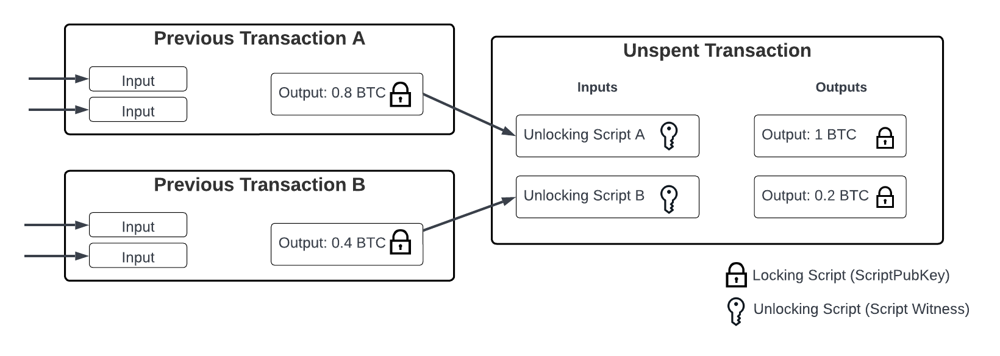
</p>

_Figure 6: Each Bitcoin transaction input is linked with an output of a previous one forming a chain of transactions. Here, unlocking Script A contains the inputs that satisfy the scriptPubKey of the previous transaction A._

Each UTXO contains a field called scriptPubKey that specifies the locking script. There are different kinds of scriptPubKey that can be used to lock up funds in a transaction. For example, SegWit transactions include the following types of scriptPubKey:

- **Pay-to-Witness-Public-Key-Hash**: P2WPKH requires the input of the next transaction to contain the proper public key and signature information in a field called the `witness` in order to spend the funds.
- **Pay-to-Witness-Script-Hash**: P2WSH requires the input of the next transaction to provide a special script called the `RedeemScript` in the witness field, along with all the inputs that the script needs to run. The script inputs appear before the `RedeemScript` in the witness, so the structure of the witness looks like: `<ScriptInputs> <RedeemScript>`.

<p align="center">
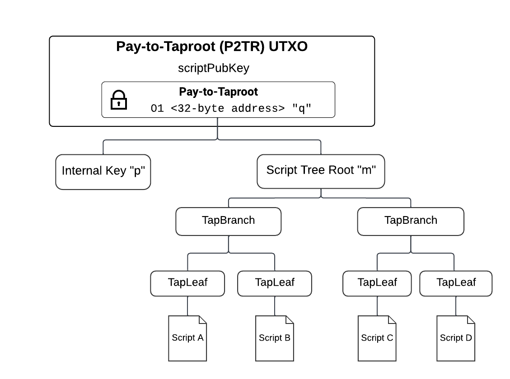
</p>

_Figure 7: This diagram shows the underlying structure of a P2TR address. Details around the public key $q$, internal key $p$, and the construction of the script tree root $m$ are provided in detailed in BIP 341 [72]._

The third type of scriptPubKey in SegWit is Pay-to-Taproot (P2TR), shown in Figure 7. It combines the functionality of both the Pay-to-Witness-Public-Key-Hash (P2WPKH) and Pay-to-Witness-Script-Hash (P2WSH) by allowing a UTXO to be spent in either of two ways: by providing a signature from a public key (key path) or by providing the ScriptInputs, RedeemScript, and Control Block to spend from one of the leafs of the Script Tree (script path). Control Block contains the leaf version, internal key, and the Merkle proof cohashes of the spending script.

### **4.2.2 Special Opcodes**

Bitcoin has a limited set of opcodes to program script conditions to spend UTXOs. To implement our L1 Rollup Protocol, we need several additional opcodes for two reasons: we need to enforce a recursive covenant and we need to be able to efficiently verify a validity proof. We can enforce a recursive covenant using a set of introspective opcodes already implemented on Elements [58]. We can efficiently verify validity proofs using a new opcode. Since verification logic is dependent on the proof system used in the rollup, we have proposed an opcode for a FRI-based proof system (e.g. STARK). Section 5.3 explains our rationale for picking FRI-based proof system in our first design iteration.

In addition to these core opcodes, there are several additional opcodes employed in our design that significantly reduce the complexity of our rollup scripts, but these are optional and not strictly required. These optional opcodes are also already implemented on Elements.

**Introspective Opcodes**

Introspective Opcodes are special opcodes available in Elements [77] that enable a Bitcoin script to access the internal data about the transaction that contains the script. We make use of these opcodes in our design to access the information on the transaction that is being executed by the Rollup Protocol. While we use these introspective opcodes in the current design, they are not explicitly necessary to implement the Rollup Protocol. It is possible to introspect transactions using only our new proof verification opcode and the existing `OP_CHECKSIGVERIFY'. Further details on this will be provided in a future design.

`OP_INSPECTINPUTVALUE <idx>`

- Allows the script to read the value of the UTXO being spent by the input referred by `<idx>`.

`OP_INSPECTINPUTSCRIPTPUBKEY <idx>`

- Allows the script to read the scriptPubKey of the UTXO being spent by the input referred by `<idx>`.

`OP_INSPECTOUTPUTVALUE <idx>`

- Allows the script to read the value of a UTXO in the current transaction. `<idx>` specifies the specific UTXO to inspect.

`OP_INSPECTOUTPUTSCRIPTPUBKEY <idx>`

- Allows the script to read the scriptPubKey of a UTXO in the current transaction. `<idx>` specifies the specific UTXO to inspect.

Introspective opcodes enable Bitcoin scripts to access data on both the UTXO being spent and the one being created within a transaction. This allows the script in the UTXOs being spent to put constraints on the UTXOs being created, as shown in Figure 8.

<p align="center">
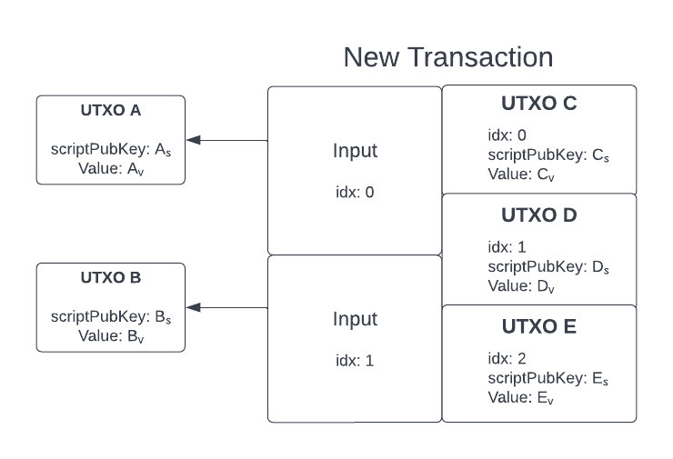
</p>

_Figure 8. Introspective Opcodes enable Bitcoin scripts to access data in the UTXO being spent and UTXO being created. Consider the two input, three output transaction shown in this Figure. `OP_INSPECTINPUTVALUE` could push values $A_v$ and $B_v$ to the stack depending on the specified index. Similarly, `OP_INSPECTOUTPUTVALUE` could push values $C_v$, $D_v$, and $E_v$. The introspective scriptPubKey opcodes would enable pushing the scriptPubKey values to the stack similarly._

**New Validity Proof Verification Opcode**

`OP_VERIFYSTARKPROOF <stark_proof> <program_hash> <stark_input_state> <stark_output_state>`

`<stark_proof>` is a proof of computation generated by a STARK prover.

`<program_hash>` is a 32-byte hash of the program being verified.

`<stark_input_state>` is a concatenation of inputs separated by special separator bytes. This value is the first item on the stack at the start of program execution.

`<stark_output_state>` is a concatenation of outputs separated by special separator bytes. This value is the first item on the stack at the end of program execution.

`OP_VERIFYSTARKPROOF` returns `True` if the following statement is true: executing a program with hash `<program_hash>` with the initial stack containing only `<stark_input_state>` will produce an output with the resulting stack containing only `<stark_output_state>`.

**Additional Optional Opcodes**

`OP_CAT <x1> <x2>`

- Concatenates two strings into one output.

`OP_SUBSTR <in> <begin> <size>`

- Produces a substring of the string `<in>` starting from index `<begin>` to index `<begin>` + `<size>`

`OP_TWEAKVERIFY <P> <k> <Q>`

- Pop the three elements as: 1) 32 byte X-only internal key `p`, 2) a 32 byte big endian, unsigned scalar `k`, and 3) 33 byte compressed point `Q`. Abort if `P`, `Q` is invalid or `k` is not 32 bytes and outside of `secp256k1` curve order. Abort if $Q \neq P + k*G$ where `G` is the generator for `secp256k1`.

### **4.2.3 Rollup Protocol as a P2TR UTXO**

Our L1 Rollup Protocol consists of a single Rollup UTXO that provides three functions:

1. Lock all funds deposited to the L2 Rollup System,
2. Store the latest Rollup State commitment that includes L2 State Root and pending deposit data,
3. Define the rollup contract with a set of spend paths, one of which must be satisfied to spend from the UTXO.

The _Rollup State_ is a 66-byte string where the first 32 bytes are for the latest confirmed L2 State Root and the next 34 bytes are for the pending deposits data, as shown in Figure 9. The latest L2 State Root is important because it allows users to withdraw their funds from the Rollup UTXO without cooperating with the L2 Rollup System by presenting a Merkle proof of their L2 account existence corresponding to the L2 State Root stored in the Rollup State. Further details about the pending deposit data and the L2 State Root fields of the Rollup State are provided in the next few subsections.

<p align="center">
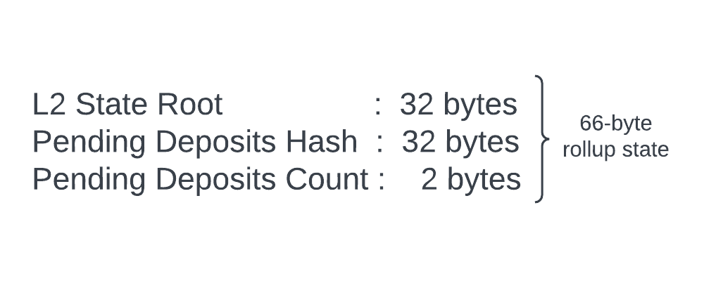
</p>

_Figure 9. The 66-byte Rollup State is a concatenation of three data fields. The pending deposit data keep track of deposit transactions that have been broadcasted or confirmed on L1, but the corresponding accounts changes on the L2 State Tree have not been confirmed yet on L1. The L2 State Root field always holds the latest confirmed L2 State Root._

There are several ways to spend the Rollup UTXO, which are each defined by a spend path in our rollup contract. All spend paths in the rollup contract use introspective opcodes to enforce that the transaction spending the Rollup UTXO must have the first transaction output be another Rollup UTXO with the same contract scripts and a correctly updated state commitment. Enforcing this recursive covenant is important because it ensures that all the funds locked in the Rollup UTXO can only ever be spent by satisfying one of the spend paths in the rollup contract.

In our design, we have three core spend paths: deposit, L2 state update, and unilateral withdrawal. We could also add additional spend paths such as graceful abort from the recursive covenant as described in [44] as simple extensions to the design, but these additional spend paths are not discussed further in this paper.

To separate the Rollup State commitment and the various spend paths within the same rollup contract, the Rollup UTXO uses a Pay-to-Taproot (P2TR) scriptPubKey. The scripts in the rollup contract are fixed, while the Rollup State commitment embedded within the contract is dynamic. We commit to the latest Rollup State using the internal key and put each of the spend paths in the rollup contract as a TapLeaf within the Taproot Script Tree. The P2TR scriptPubKey construction used for every Rollup UTXO is shown in Figure 10.

<p align="center">
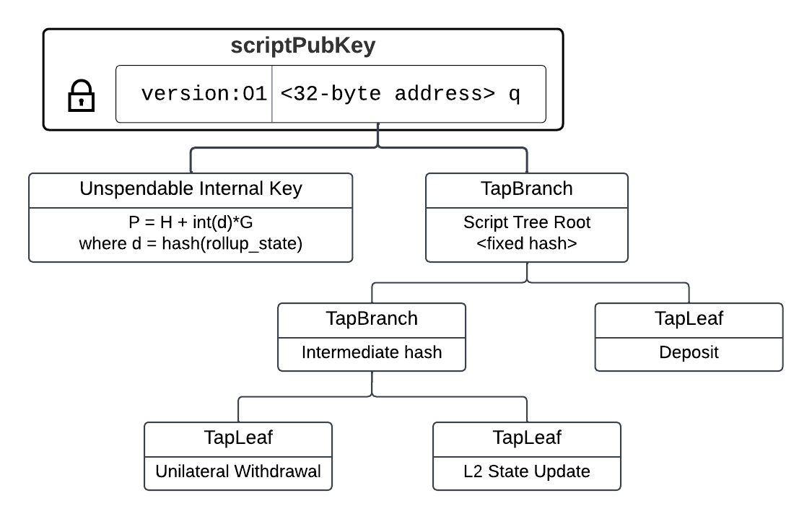
</p>


_Figure 10. The Rollup UTXO uses a P2TR scriptPubKey described in this diagram. For a general P2TR, users can either spend by presenting a valid signature corresponding to the internal public key P or by presenting a valid witness satisfying a TapLeaf script within the Taproot Script Tree. For our rollup construction, we use an unspendable internal key as a Rollup State commitment and TapLeafs to specify different spending paths. See BIP 341[72] for additional details on Taproot._

The Script Tree root must be constant for every Rollup UTXO to ensure no scripts get added or modified. This invariant is enforced in every TapLeaf script, which stores the fixed Script Tree Root as a constant variable within the script. Thus, every Rollup UTXO can only be spent from the same set of pre-defined scripts.

Internal key of the Rollup UTXO represents a commitment to the Rollup State. Script validation rules described in BIP 341 [72] require the internal key to correspond to a point on the `secp256k1` curve, but our construction requires the internal key to be unspendable. To address these constraints, we must use an internal key that corresponds to a point on the curve with a provably unknown private key. We use the following equation to derive the internal key.

$$
P = H + \textrm{int}(\textrm{hash}_{}(rollup\_state))\times G
$$

Here, $P$ is the Taproot internal key point, $H$ is a point with an unknown discrete logarithm, rollup_state is a bytestring of the _rollup state_ that changes in every new Rollup UTXO, and $G$ is the generator point. We can choose $H=(x,y)$, where $x$ is hash of the standard uncompressed encoding of the `secp256k1` base point $G$, as suggested in BIP 341. Since $\textrm{int}(\textrm{hash}(H\  || \ \textrm{hash}(rollup\_state)))$ is sufficiently random and each TapLeaf script enforces that the internal key for a new Rollup UTXO is computed exactly this way, it can be concluded that $P$ does not have a known discrete logarithm. We use the X-coordinate of $P$ as our internal public key, which serves as the commitment to the _rollup state_.

The L1 Rollup protocol handles three types of transactions: deposit, L2 state update and unilateral withdrawal. In the following sections, we discuss in details the construct of these transactions and the associated scripts in the rollup contract.

### **4.2.4 Deposit**

Users can deposit funds into the L2 Rollup System by creating a deposit transaction that spends from the Rollup UTXO. The transaction structure of a deposit transaction is shown in Figure 11.

Deposit transaction updates the pending deposit data in the Rollup State and commits this within the internal key of the P2TR scriptPubKey for the new Rollup UTXO. The L2 Rollup System detects the pending deposit transaction in the L1 Mempool and updates the L2 state to include this deposit. The new L2 State Root, containing the deposited funds in the appropriate L2 account, is settled with a state update transaction. Once the state update transaction is confirmed, the deposit is no longer pending and thus will not be tracked in the Rollup State.

<p align="center">
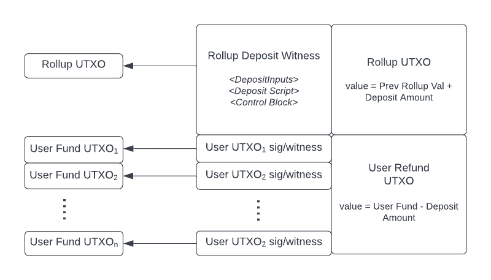
</p>

_Figure 11. A deposit transaction creates a new Rollup UTXO with the deposited funds added to the rollup value and a Refund UTXO for the user. A user may spend multiple User Fund UTXOs, all spendable by the user, totaling the deposit amount. The witness includes the deposit script inputs, deposit script, and the control block proving the existence of the Deposit TapLeaf._

Funds are deposited to the Rollup UTXO sequentially, where each user spends from the latest Rollup UTXO to create an updated Rollup UTXO that includes their deposit. Relevant deposit data, including the public key identifying the user and deposit value, are hashed and committed to the Rollup State while the deposit is still pending. We use a Merkle Mountain Range [74] to commit sequential deposit data into a single pending deposits hash within the Rollup State. Figure 12 shows how the Pending Deposits Hash and Pending Deposits Count of the Rollup State gets updated as we construct the Merkle Mountain Range.

<p align="center">
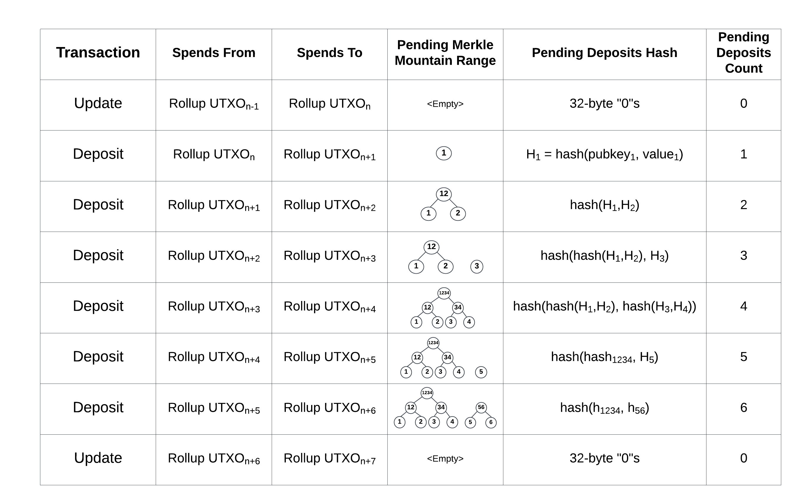
</p>

_Figure 12. A user creates a deposit transaction by spending from the deposit path of the Rollup UTXO. This deposit transaction creates a new Rollup UTXO with an updated Rollup State commitment and the deposited amount added to the UTXO value. Pending Deposits Hash and Count are updated in the Rollup State as shown in the figure. The Pending Deposits Hash is computed by taking the hash of the concatenation of the Merkle Range roots from left to right. After the deposits are processed in L2 and the L2 state change containing the pending deposits is settled on L1 with an update transaction, the pending deposits data is reset._

**Deposit Script Inputs**

| Input                  | Size          | Description                                 |
| ---------------------- | ------------- | ------------------------------------------- |
| <deposit_merkle_roots> | variable-size | concatenated Merkle mountain range roots    |
| <deposit_public_key>   | 32-byte       | L1 public key of the depositer              |
| <deposit_amount>       | 4-byte        | Amount deposited to L2 Rollup               |
| <current_rollup_state> | 66-byte       | Rollup State of Rollup UTXO being spent     |
| <current_internal_key> | 32-byte       | internal key p of Rollup UTXO being spent   |
| <new_internal_key>     | 32-byte       | internal key p of Rollup UTXO being created |

All of these witness fields have a fixed size except for `<deposit_merkle_roots>`. We use 20-byte hashes for the pending deposit Merkle mountain range and enforce a maximum of 1024 pending deposits, so the maximum size of `<deposit_merkle_roots>` is 200 bytes. These witness fields are used by the deposit script to verify that the new Rollup UTXO resulting from the deposit transaction is correct. This script, which is embedded within the Deposit TapLeaf, is described below.

**Deposit Script**

1. **Verify that the new Rollup UTXO Value is correct.**
   1. Use `OP_INSPECTINPUTVALUE` to inspect the value of the Rollup UTXO being spent (the first input) and `OP_INSPECTOUTPUTVALUE` to inspect the value of the Rollup UTXO being created (the first output). Then verify that the latter is `<deposit_amount>` greater than the former value.
2. **Verify `<current_rollup_state>` is correct.**
   1. First verify that the `<current_internal_key>` is correct. We can do this by introspecting the scriptPubKey of the Rollup UTXO being spent with `OP_INSPECTINPUTSCRIPTPUBKEY`, and then using `OP_TWEAKVERIFY` to verify that `<current_internal_key>` and the constant Taproot Script Tree root produce the output key in the Rollup UTXO being spent.
   2. Then use `OP_TWEAKVERIFY` again to verify that the constant $H$, which is a point with an unknown discrete logarithm, and `<current_rollup_state>` produce `<current_internal_key>`. This sufficiently proves that the `<current_rollup_state>` is correct.
3. **Compute the new Rollup State.**
   1. First extract Pending Deposits Hash and Pending Deposits Count from the `<current_rollup_state>`.
   2. Then verify that the `<deposit_merkle_roots>` is correct. The hash of `<deposit_merkle_roots>` should be equal to Pending Deposits Hash.
   3. Then compute the hash of the concatenation of `<deposit_public_key>` and `<deposit_amount>`.
   4. Then add this computed hash of the current deposit data to the current Merkle Mountain Range (MMR). The current peaks of the mountain range are provided by `<deposit_merkle_roots>`, so an MMR Update will produce an updated list of mountain range peaks that incorporates current deposit data. Take the hash of the concatenation of the new peaks to compute the new Pending Deposits Hash.
   5. Increment Pending Deposits Count by one. Concatenate the unchanged L2 State Root, the new Pending Deposits Hash, and the new Pending Deposits Count to produce the new Rollup State.
4. **Verify that the new Rollup UTXO scriptPubKey uses an unchanged Taproot Script Tree and uses the correct Rollup State data commitment as the internal key.**
   1. First verify that the `<new_internal_key>` is correct using the computed new Rollup State. We can do this with `OP_TWEAKVERIFY` to check that `<new_internal_key>` equals $H + \textrm{int}(\textrm{hash}(computed\_rollup\_state)) \times G$, where $H$ is a constant variable in the script.
   2. Then introspect the new Rollup UTXO scriptPubKey address with `OP_INSPECTOUTPUTSCRIPTPUBKEY`. Verify that this scriptPubKey address was computed with `<new_internal_key>` and the unchanged Script Root using `OP_TWEAKVERIFY`. This check enforces the recursive covenant because it sufficiently proves that the Rollup UTXO being created uses an unchanged Taproot Script Tree and a correctly updated Rollup State.

### **4.2.5 L2 State Update**

L2 state update transaction is broadcasted by the L2 Rollup System to propose a new L2 State Root. It includes all withdrawals requested by users in L2. The transaction structure of an L2 state update transaction is shown in Figure 13.

<p align="center">
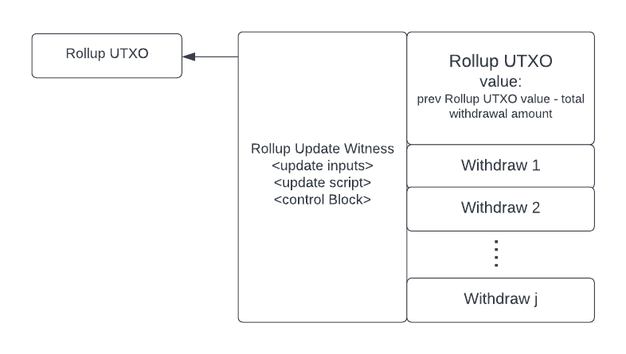
</p>

_Figure 13. The L2 Rollup System can settle a batch of L2 transactions and create user-requested withdrawal UTXOs by spending from the update path of the Rollup UTXO. An update transaction creates a new Rollup UTXO with the total withdrawal value subtracted from the rollup value and a batch of Withdrawal UTXOs._

The L2 Rollup System creates this update transaction to confirm a batch of transactions. Since our L2 System allows for expressive smart contracts, these transactions are not limited to payments like withdrawal and transfers. These transactions are more generic and represent smart contract function calls in the L2 System. Details about the construction of these inputs are discussed in Section 4.3.2.2.

**L2 State Update Script Inputs**

| Input                   | Size          | Description                                                            |
| ----------------------- | ------------- | ---------------------------------------------------------------------- |
| <stark_proof>           | variable size | validity proof of state transition integrity                           |
| <new_L2_state_root>     | 32 bytes      | new L2 State Root                                                      |
| <compressed_block_data> | variable size | compressed encoding of new transactions describing all account changes |
| <coordinator_signature> | 32 bytes      | signature of the L2 Rollup System Coordinator                          |
| <current_rollup_state>  | 66 bytes      | Rollup State of Rollup UTXO being spent                                |
| <current_internal_key>  | 32-byte       | internal key p of Rollup UTXO being spent                              |
| <new_internal_key>      | 32-byte       | internal key p of Rollup UTXO being created                            |

**L2 State Update Script**

1. Verify that the authorized coordinator signed this transaction.
    i. Use `OP_CHECKSIG` to verify `<coordinator_signature>` against known public key of the authorized coordinator.
2. **Verify that the new Rollup UTXO Value is correct.**
   1. First extract withdrawal data from `<compressed_block_data>`. Calculate the sum of all withdrawal amounts.
   2. Then use `OP_INSPECTINPUTVALUE` to inspect the value of the Rollup UTXO being spent and `OP_INSPECTOUTPUTVALUE` to inspect the value of the Rollup UTXO being created. Then verify that the latter is less than the former by the value calculated in 2(1).
3. **Verify <current_rollup_state> is correct.**
   1. First verify that the `<current_internal_key>` is correct. We can do this by introspecting the scriptPubKey of the Rollup UTXO being spent with `OP_INSPECTINPUTSCRIPTPUBKEY`, and then using `OP_TWEAKVERIFY` to verify that `<current_internal_key>` and the constant Taproot Script Tree root produce the output key in the Rollup UTXO being spent.
   2. Then use `OP_TWEAKVERIFY` again to verify that the constant $H$, which is a point with an unknown discrete logarithm, and `<current_rollup_state>` produce `<current_internal_key>`. This sufficiently proves that the `<current_rollup_state>` is correct.
4. **Verify all of the pending deposit data is included in the <**`compressed_block_data`**>.**
   1. First extract Pending Deposits Hash and Pending Deposits Count from the `<current_rollup_state>`.
   2. Extract the deposit data from `<compressed_block_data>` and verify that the total number of deposits is equal to Pending Deposits Count. Then construct the MMR from the deposit data. Verify that the hash of the concatenated MMR peaks is equal to the Pending Deposits Hash.
5. **Verify that the withdrawal transactions included in the `<compressed_block_data>` have corresponding Withdrawal UTXOs in the transaction output.**
   1. Extract the withdrawal data from `<compressed_block_data>`.
   2. Verify the total number of Withdrawal UTXO in the transaction output match the total number of withdrawals in `<compressed_block_data>`.
   3. For each withdrawal data in `<compressed_block_data>`, introspect the transaction output using `OP_INSPECTOUTPUTSCRIPTPUBKEY` with the appropriate index to get the corresponding Withdrawal UTXO. Verify that the Withdrawal UTXO Value and scriptPubKey address match the withdrawal data.
6. **Verify that the L2 state transition is correct.**
   1. Prepare the parameters to pass into `OP_VERIFYSTARKPROOF`, which consist of `<stark_proof>`, `<stark_input_state>`, `<stark_output_state>`, and `<stark_program_hash>`. The `<stark_program_hash>` is a fixed constant stored within this script and represents the publicly known state transition function which encodes L2 state update rules. Set `<stark_input_state>` to `<current_L2_state_root>` and set `<stark_output_state>` to the concatenation of `<new_L2_state_root>` and the hash of `<compressed_block_data>`.
   2. Verify the validity proof using `OP_VERIFYSTARKPROOF` with parameters `<stark_proof>`, `<stark_input_state>`, `<stark_output_state>`, and `<stark_program_hash>`.
7. **Compute the new Rollup State.**
   1. Reset the pending deposits data. Set Pending Deposits Hash to 32-bytes of zeros. Set Pending Deposits count to 0.
   2. Concatenate `<new_L2_state_root>` with the reset pending deposits data to produce the new Rollup State.
8. **Verify that the new Rollup UTXO scriptPubKey uses an unchanged Taproot Script Tree and uses the correct Rollup State data commitment as the internal key.**
   1. First verify that the `<new_internal_key>` is correct using the computed new Rollup State. We can do this with `OP_TWEAKVERIFY` to check that `<new_internal_key>` equals $H + \textrm{int}(\textrm{hash}(computed\_rollup\_state))\times G$, where $H$ is a constant variable in the script.
   b. Then introspect the new Rollup UTXO scriptPubKey address with `OP_INSPECTOUTPUTSCRIPTPUBKEY`. Verify that this scriptPubKey address was computed with `<new_internal_key>` and the unchanged Script Root using `OP_TWEAKVERIFY`. This check enforces the recursive covenant because it sufficiently proves that the Rollup UTXO being created uses an unchanged Taproot Script Tree and a correctly updated Rollup State.

### **4.2.6 Unilateral Withdrawal**

Unilateral Withdrawal Transaction is submitted by the user directly to the L1 Rollup Protocol. Typically users withdraw rollup funds by submitting a request to the L2 Rollup System, which is then processed in a state update transaction. However, a user can also create a unilateral withdrawal transaction to withdraw rollup funds without the cooperation of the L2 Rollup System, which is important in the event that the L2 Rollup System is uncooperative. The transaction structure of a unilateral withdrawal transaction is shown in Figure 14.

<p align="center">
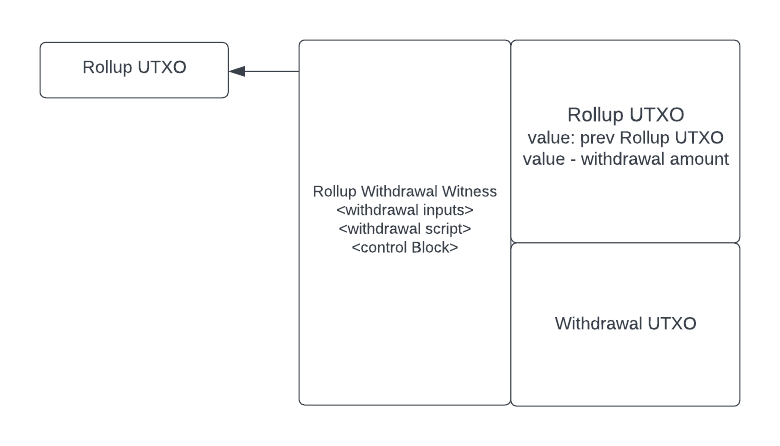
</p>

_Figure 14. Users can withdraw funds from the Rollup without collaborating with the L2 Rollup System by spending from the unilateral withdrawal path. A unilateral withdrawal transaction creates a new Rollup UTXO with the withdrawal value subtracted from the rollup value and a new Withdrawal UTXO._

To unilaterally withdraw funds from the Rollup UTXO, a user must present a Merkle proof of their L2 account with sufficient funds against the latest confirmed L2 State Root. The necessary data to construct a withdrawal proof is available on L1, thus enabling a user to construct this transaction without the cooperation of the L2 Rollup System.

**Unilateral Withdrawal Script Inputs**

| Input                  | Size          | Description                                                                                      |
| ---------------------- | ------------- | ------------------------------------------------------------------------------------------------ |
| <withdrawal_proof>     | variable size | concatenated cohahses for Merkle proof that account exists in the latest confirmed L2 State Tree |
| <signature>            | 32 bytes      | signature associated with the account's public key                                               |
| <withdrawal_amount>    | 4 bytes       | requested withdrawal amount                                                                      |
| <L2_account_data>      | 76 bytes      | the L2 account_address, balance, nonce, and storage_root fields                                  |
| <current_rollup_state> | 66 bytes      | Rollup State of Rollup UTXO being spent                                                          |
| <current_internal_key> | 32-byte       | internal key p of Rollup UTXO being spent                                                        |
| <new_internal_key>     | 32-byte       | internal key p of Rollup UTXO being created                                                      |

**Unilateral Withdrawal Script**

1. Verify the `<withdrawal_amount>`.
    1. First verify that `<withdrawal_amount>` is less than or equal to the value inside `<L2_account_data>`.
    2. Then use `OP_INSPECTINPUTVALUE` to inspect the value of the Rollup UTXO being spent and `OP_INSPECTOUTPUTVALUE` to inspect the value of the Rollup UTXO being created. Verify that the latter is exactly `<withdrawal_amount>` less than the former value.
2. Verify the `<current_rollup_state>` is correct.
    1. First verify that the `<current_internal_key>` is correct. We can do this by introspecting the scriptPubKey of the Rollup UTXO being spent with `OP_INSPECTINPUTSCRIPTPUBKEY`, and then using `OP_TWEAKVERIFY` to verify that `<current_internal_key>` and the constant Taproot Script Tree root produce the output key in the Rollup UTXO being spent.
    2. Then use `OP_TWEAKVERIFY` again to verify that the constant H, which is a point with an unknown discrete logarithm, and `<current_rollup_state>` produce `<current_internal_key>`. This sufficiently proves that the `<current_rollup_state>` is correct.
3. Verify the L2 account exists in the latest confirmed L2 State Tree.
    1. First extract the L2 State Root from the `<current_rollup_state>`.
    2. Then take the hash of the `<L2_account_data>` to get the account leaf hash. Combine the account leaf hash with the cohashes in `<withdrawal_proof>` to construct the Merkle root. Verify that the computed Merkle Root is equal to L2 State Root.
4. Verify the L2 account belongs to the user creating the transaction.
    1. First extract the account_address (L1 public key) field inside `<L2_account_data>`.
    2. Then verify the `<signature>` together with the account_address using `OP_CHECKSIGVERIFY`.
5. Compute the new Rollup State.
    1. Update the balance, nonce and storage_root inside `<L2_account_data>` and compute the updated account leaf hash.
    2. Use the updated account leaf hash and `<withdrawal_proof>` to compute the new Merkle Root.
    3. Update the L2 State Root in `<current_rollup_state>` to the computed Merkle Root.
6. Verify that the new Rollup UTXO scriptPubKey uses an unchanged Taproot Script Tree and uses the correct Rollup State data commitment as the internal key.
    1. First verify that the `<new_internal_key>` is correct using the computed new Rollup State. We can do this with `OP_TWEAKVERIFY` to check that `<new_internal_key>` equals $H + \textrm{int}(\textrm{hash}_{}(computed\_rollup\_state))\times G$, where $H$ is a constant variable in the script.
    2. Then introspect the new Rollup UTXO scriptPubKey address with `OP_INSPECTOUTPUTSCRIPTPUBKEY`. Verify that this scriptPubKey address was computed with `<new_internal_key>` and the unchanged Script Root using `OP_TWEAKVERIFY`. This check enforces the recursive covenant because it sufficiently proves that the Rollup UTXO being created uses an unchanged Taproot Script Tree and a correctly updated Rollup State.

### **4.2.7 Proof Verification Opcode**

We propose to introduce in Bitcoin a verification opcode for FRI-based proof system (STARK). Section 5.4 goes more into the details of FRI-based proof system. The implementation of such verifier requires only the cryptographic assumption of a collision-resistant hash function like SHA256, which is available in Bitcoin. In addition, the verification process is poly-logarithmic with respect to the size of the computation, which translates to under 2 ms for a proof size of about 100 KB [60]. This is what we expect for our rollup design.

We propose `OP_VERIFYSTARKPROOF` opcode to verify a FRI-based proof. It takes as inputs `<stark_proof>, <program_hash>, <stark_input_state>, and <stark_output_state>`. The interface is described in detail in Section [4.2.2](notion://www.notion.so/ZK-Rollup-on-Bitcoin-Technical-Whitepaper-V0-85-Overleaf-65778965e6684683943102d8dc76c109#section_4.2.2).

**Usage in our design**

`<stark_proof>` is the proof generated by the Prover.

`<program_hash>` is the hash of the state transition program described in Section 4.3.3. The state transition program is a fixed program specific to our rollup and is publicly shared and auditable.

`<stark_input_state>` is the L2 State Root of the last confirmed L2 State Tree. This is the input to the state transition program.

`<stark_output_state>` is the concatenation of the new L2 State Root and the hash of the compressed block data.

The L1 Rollup Protocol constructs the `<stark_output_state>` from the proposed new L2 State Root and the compressed block data committed by the L2 Rollup System along with the proof. This construction ensures that the verifier performs the verification on the committed set of public inputs, and therefore will fail if the proof was generated using different inputs. For example, if the committed set of compressed block data is inconsistent with the block of transactions used to generate the proof, verifier will fail. This ensures the correctness of the witness data posted to L1 blockchain. Also note that the verifier does not need the entire program, but rather only its hash, to be able to verify the accuracy of its execution. This is at the heart of verifiable computation, in which the verifier outsources the computation to the prover but can still verify its correctness without the knowledge of specific details of the computation.

`OP_VERIFYSTARKPROOF` executes STARK verification protocol using the `<stark_proof>` and public inputs (`<program hash>`, `<stark_input_state>` and `<stark_output_state>`). It pushes `True` in the stack if the verification is successful and `False` if the verification fails. Internally, `OP_VERIFYSTARKPROOF` uses a fixed arithmetization scheme that encodes the constraints of a general zkVM execution stack. The Prover in L2 Rollup System uses the same arithmetization to generate the validity proof. We do not discuss in detail the design of such scheme in this paper. However, we address potential options for Bitcoin in Sections 5.3 and 5.4.

## **4.3 Layer 2 Rollup System**

In this section, we introduce an expressive L2 Rollup System on top of the Bitcoin Rollup Protocol we introduced in Section 4.2. This L2 System is capable of executing arbitrary smart contracts that can support decentralized finance applications, while inheriting the double-spend security of Bitcoin without any additional security assumptions. Since there are multiple rollup systems implemented for other blockchains, we show a simple L2 rollup construction, inspired by Ethereum and StarkNet, capable of handling complex smart contracts. The L2 Rollup System demonstrates the capabilities that can be built on top of the Bitcoin Rollup Protocol, but does not strictly subscribe to a particular implementation.

### **4.3.1 Overview and Architecture**

In this section, we provide an overview of key building blocks and concepts in our L2 Rollup System such as accounts, smart contracts, transactions, and data availability. In subsequent sections, we discuss the details of system components and how they interact with each other.

### **4.3.1.1 Accounts**

In our design, there is no structural difference between an account that belongs to a user and an account that belongs to a smart contract; both are implemented as contract accounts. This idea is referred to as “account abstraction”, introduced in EIP 4337 [78] and also implemented by StarkNet [79]. Abstracting a user account as a contract account, as opposed to a static representation such as in Ethereum, allows the user much more flexibility on the process of validation and execution of the transactions they initiate. For example, user can choose to validate their transaction with the phone’s face ID instead of signing with their private key, or choose to pay with a currency different than bitcoin. In addition, user can customize how their account functions in response to a transaction they receive. This allows for a much better user experience, and supports adding complex payments such as subscriptions or streaming payments right in the account construct.

**L2 Global Accounts State**

The global state of all accounts is stored in a Merkle tree of height 40, which allows for over one trillion accounts. This tree is also referred to as L2 State Tree. Each leaf node in this tree can be uniquely encoded with a 5-byte index referred to as `account_id`, whose binary representation is the path to this leaf in the tree. Each leaf commits to the following account data.

```python
account_address # 32 bytes
balance # 8 bytes
nonce # 4 bytes
storage_root # 32 bytes
```

`account_address` is a unique L2 address of a contract account. For a user-owned account it is the user’s L1 public key, and for the non-user-owned account it is derived from the smart contract code associated with this account. `balance` is the bitcoins available for this account to spend. `nonce` is the number that starts with 1 and increments by 1 every time this account initiates a transaction or creates a new contract. This field is primarily used to prevent replay attacks in which an attacker may try to resubmit the same transaction multiple times. `storage_root` is the root of a Patricia-Merkle trie that stores the data associated with this account that the smart contract can access or update. This two-level structure is similar to Ethereum, but with a slightly different construct for the top tree. While Ethereum uses a Patricia-Merkle trie for 20-byte account addresses, we use a much smaller Merkle tree, storing 5-byte account ids. We do this to reduce the L1 data footprint, since account ids need to be posted to L1 for data availability purpose.

Leafs in the L2 State Tree are initialized with empty values. A new account is created by populating a leaf with the account data, and is added to an empty leaf immediately to the right of the last created account. For example, the first account is stored in the leftmost leaf of the tree and is identified by an ID of 0 represented by 5 bytes. The second account is stored in the adjacent leaf to the right and is identified by an ID of 1 represented by 5 bytes, and so forth.

**Storage Tree:**

Each account contains `storage_root` which refers to the root of its storage tree. Storage tree stores the storage data of an account, i.e. the variables and the values designated in the contract as its global state. For example, smart contracts may want to persistently store, access, and update user balances, the total number of tokens remaining, or any other arbitrary state. These variables may update when the contract functions are invoked, changing the storage tree, hence changing the storage root of an account, and finally changing the entire L2 State Tree.

We use Patricia-Merkle trie to store the persistent data for each account as key-value mappings. Patricia-Merkle trie allows for efficient retrieval and update for key-value mappings while being storage-efficient and having a concise root hash as a commitment to be stored in account data. For our L2 Rollup System, we have adapted the storage trie design similar to Ethereum, in which a key is a 32-byte hash of the “index” of the leaf node, and it is associated with a variable name. Each leaf node contains a 32-byte “slot”, and a slot, or multiple slots, stores the RLP encoding of the value of the variable that the leaf represents. This construction can store values with a wide variety of data types such as strings, arrays, and maps [80].

### **4.3.1.2 Smart Contracts**

Smart contracts are made up of data and functions, similar to an object-oriented class structure. The data for a contract is stored in the storage tree of the associated account. Functions can have arbitrary logic, can be private or public, and can access and update the contract data. A public function can be invoked by external accounts through a transaction or a call from within their contract code.

We do not discuss in detail the specific programming language or the VM environment for the smart contracts. The L2 Rollup System we propose can incorporate any Turing complete or Turing incomplete programming language to implement smart contracts, including Solidity, Simplicity, or Cairo.

**User-Owned Contracts**

User-owned contracts implement two special functions, namely `validate()` and `execute()`, in addition to any other functions. During execution of a transaction initiated by this account, the system calls the `validate()` function to verify that the transaction is properly authorized, and then calls the `execute()` function to execute the transaction. This separation of validation and execution is a specific implementation of account abstraction adopted by StarkNet, and we use it for our design as an example. A pseudocode of a minimal account contract is shown below.

```
@external
func validate(transaction_data, signature):
    # Signature is the default validation. But user can customize.
    check_signature(transaction_data, signature)
end

@external
func execute(transaction_data, signature):
		call_data = transaction_data.call_data

		# Log some data. Example of a user customization.
    log(call_data.contract_address, call_data.target_function)

    # Call the specified contract.
    call_contract(
			contract_address = call_data.contract_address,
			target_function = call_data.target_function,
			function_args = call_data.function_args)
end
```

The `transaction_data` and `signature` are passed to both the validate and execute functions during transaction execution. `transaction_data` includes `call_data`, which contains the arguments required for `call_contract()` function. `check_signature()`, `log()`, and `call_contract()` are the examples of system calls available to the smart contracts.

**Non-User-Owned Contracts**

A non-user-owned contract is deployed by a user with an existing account in the L2 Rollup System. The contract’s constructor function is run once, only during deployment. Typically, the constructor function initializes the contract with an initial state such as the total supply of a coin or the owner of the contract. Once the contract is deployed, the smart contract is an autonomous agent, functioning and updating its state according to its code.

**Special Coordinator Smart Contract**

The L2 Rollup System contains a privileged, global smart contract account deployed by the rollup coordinator that defines transactions like create_account, transfer and withdraw. This smart contract is capable of calling the system functions that update the global L2 State Tree, while all other smart contracts can only change their own state. When a user wants to transfer bitcoin to another contract account or withdraw bitcoins from L2, they interact with this smart contract. This is a design chosen to abstract the transaction execution functions from system layer to contract layer, aligning with the idea of account abstraction. The interface of this special contract is as follows:

```
# Transfer bitcoin to another contract. If the receiving contract is not
# user-owned, it triggers a receive function in the destination contract.
@external
func transfer(destination_account_address, amount)

# Withdraw all or some bitcoins to an L1 address
@external
func withdraw(amount, destination_L1_address)
```

### **4.3.1.3 Transactions**

**L2 Transactions**

An L2 transaction is initiated by a user-owned contract account. Each transaction has the following structure.

```python

sender # L1 pubkey of sender
call_data # Contains the information on the target contract address and the target function to call along with its arguments. (For Deploy transaction, encodes entire smart contract code bytes).
nonce # this should be equal to the nonce of the sender account. During transaction execution, the sender account's nonce gets incremented, and the next transaction will be required to have different nonce.
```

There are two types of L2 transactions: a Deploy transaction when a user wants to deploy a new smart contract and an Invoke transaction when a user wants to call a particular function of an external smart contract. To perform a simple transfer to another account (”transfer transaction”) or to withdraw funds (”withdrawal transaction”), user creates an Invoke transaction targeting the coordinator smart contract described in Section 4.3.1.2 and the appropriate function to run.

| Transaction Type | Properties                                                                             | Intent                                                                    |
| ---------------- | -------------------------------------------------------------------------------------- | ------------------------------------------------------------------------- |
| Deploy           | call_data is populated with code bytes                                                 | User wants to deploy a new smart contract.                                |
| Invoke           | call_data is populated with smart contract and its function to call with the arguments | User wants to invoke a particular function of an external smart contract. |

The `call_data` has the following structure:

```python
# For Invoke transaction
contract_address # account_address of the contract account being called
target_function # function to call in the contract
function_arguments # arguments of the target function

# For Deploy transaction
code_bytes # the code bytes that make up the smart contract code
```

In practice, a transaction also includes information on fees, but we omit it in this paper. For user-owned accounts, L1 public keys are used as addresses for better user experience. Users can sign any transaction, whether L1 or L2, with the same key. The L1 public keys are internally mapped to L2 account ids.

The transaction structure and the field values are validated for correct construction before accepting transactions into the rollup system. When transactions are executed, it changes the state of the accounts, which changes the global state of the rollup, i.e. the L2 State Tree.

**L1 Transactions**

The L2 Rollup System also keeps track of the transactions initiated on the Bitcoin layer, namely deposits and unilateral withdrawals. A deposit transaction in L1 causes a new user account creation or an increase in the balance of an existing account in L2. On the other hand, a unilateral withdrawal transaction causes a decrease in the balance of an account in L2. Those L2 state changes are performed by the system during the transaction execution stage described in Section 4.3.3.

### **4.3.1.4 Data Availability**

The L2 block data needs to be posted in a compressed form to L1 so that anyone can construct the L2 State Tree just by inspecting the Bitcoin blockchain. This is important in the case where the L2 System fails, and the users need to make a unilateral withdrawal transaction on L1 to release their funds. This is also called data availability. In addition, the compressed data is also used by the Bitcoin Rollup Protocol to verify the accuracy of the state update transaction broadcasted to L1. The compressed block data has the following structure:

`<header><deposits><state_diff><withdrawals>`

The withdrawals data do not include the unilateral withdrawals initiated in L1, since their data is already available in L1. Figure 15 shows the fields and sizes of header, an average deposit, and average withdrawal. We discuss state diff in the next section.

<p align="center">
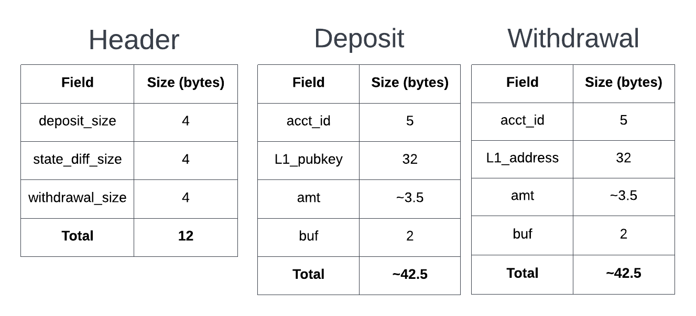
</p>

_Figure 15: Compressed block data is sent as a byte string that starts with a header that describe the contents of the data and is followed by the Deposit, State Diff, and Withdrawals. Unilateral Withdrawal transactions are not present in the compressed block data as they are already available on L1, hence they are not a requirement for data availability._

**State Diff**

For transactions other than deposits and withdrawals, we post the “delta” or “diff” of the accounts changed in the block. State diff has some header information followed by the body.

State Diff Header:

Number of deployed contracts, D (2 bytes),

Number of updated accounts with no storage update i.e. only update in balance and nonce (as a result of simple transfer transactions), T (2 bytes)

Number of updated accounts with storage update (as a result of transactions interacting with smart contracts), S (2 bytes)

State Diff Body:

For each deployed contract: account_id (5 bytes), account_address (32 bytes).

For each updated account with no storage update: account_id (5 bytes), new_balance (~4 bytes on avg+.5 byte to denote the size), new_nonce (2 bytes on avg + .5 byte to denote the size ).

For each updated account with storage update: Everything above + `<storage_diff>` - a list of key-value updates in the account storage. 


`<storage_diff>` contains:

Number of key-value updates, K (2 bytes).

For each key-value update: updated key: 16 bytes on avg (+ 1 byte to denote the size), updated value: 16 bytes on avg (+ 1 byte to denote the size)

Hence, the total size of the `<state_diff>` is: 6+25D+12T+(34K+14)S. The estimation of the distribution of D, P, and S is performed on the basis of real Ethereum transactions, as discussed in the next subsection, is used in table below. Furthermore, we assume 5 key-value updates on average per account with storage update (K).

| State Diff Body Component                                    | Unit Size (bytes) | Distribution |
| ------------------------------------------------------------ | ----------------- | ------------ |
| Deployed Contracts, D                                        | 37                | <0.0001      |
| Accounts with no storage update (simple transfers), T        | 11.5              | 0.58         |
| Accounts with storage update (smart contract interaction), S | 183.5             | 0.42         |

With these estimates, we calculate the average size of state diff body per account to be 83.74 bytes. The analysis shows that there are roughly 0.787 unique account updates per transaction, as discussed in the next subsection, which means the average size of state diff body per transaction is ~66 bytes.

We expect the overwhelming majority of the compressed block data to be the state diff body, and it is the component that has the most size per transaction. Therefore, for sake of simplification to the readers, we consider the worst case size by assuming 100% of the compressed data to contain state diff body. Therefore, for a block with 1000 transactions, the size of compressed block data is 66 KB.

**Analysis — Transaction distribution in Ethereum**

We look at transactions on Ethereum to estimate the distribution of the variables D, T, and S introduced above. Since the required aggregate statistics aren’t readily available, we use a data dump provided by Blockchair for Nov 15th, 2022 and Jan 26th, 2023 to analyze the detail transaction data in the combined 14,317 blocks [82]. We chose these two random days in a period of three months to cross-verify results and reduce statistical bias in our estimation. We found that these two days resulted in a similar distribution. The analysis we present is on the aggregated data.

There were 2.18 million transactions processed on Ethererum by 879,00 different addresses in the blocks corresponding to the aforementioned two days. After removing a tiny fraction(<1%) of coinbase transactions, which are not relevant in our design, the distribution of the rest of the transaction types (as encoded by Blockchair) is shown in the table below.

| Transaction type     | Number of Transactions | Description                                                                                                                       |
| -------------------- | ---------------------- | --------------------------------------------------------------------------------------------------------------------------------- |
| create + create_tree | 2153 (~0%)             | Deployment of contracts (D).                                                                                                      |
| call                 | 1257818 (~58%)         | Simple ETH transfers to a user account or a contract (T).                                                                         |
| call_tree            | 925804 (~42%)          | Transactions that trigger additional calls in smart contracts. (These transactions likely update the storage of the account) (S). |

Furthermore, we estimated the average number of distinct account updates for each transaction because we post account updates in our state diff instead of transactions. For every 10-minute duration, which is the expected block time for our rollup system, we counted the number of transactions in all the Ethereum blocks during that timeframe and divide by total number of distinct addresses involved in those transactions. We found that each account on average was responsible for 1.27 transactions, which equates to 0.787 distinct account changes per transaction.

### **4.3.1.5 System Components**

The L2 rollup system consists of three major components: the rollup coordinator, the transaction executor, and the prover. These components work together to produce a block of transactions, execute them, and generate a proof of valid L2 state transition to submit to L1 for verification. We discuss their functions in detail in the following subsections.

### **4.3.2 Rollup Coordinator**

A Rollup Coordinator is responsible for accepting and validating transactions, aggregating them into a block, updating the L2 State Root, and broadcasting the L2 State Update Transaction.

<p align="center">
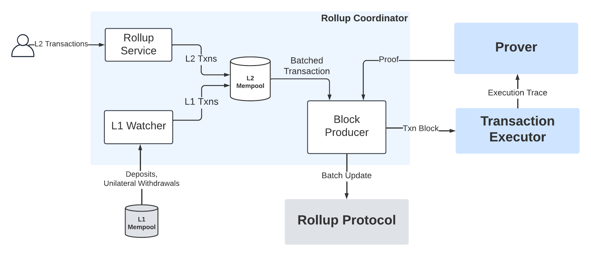
</p>

_Figure 16: Rollup Coordinator includes the Rollup Service, L1 Watcher, L2 Mempool, and the Block Producer. The L2 Mempool holds queues that store incoming transactions in the Rollup layer. The Rollup Service is an RPC interface that allows L2 users to submit transactions. The L1 Watcher facilitates communication between the Bitcoin Layer and the Rollup layer. Block Producer validates L2 blocks and initiates L2 State Update transactions._

### **4.3.2.1 Rollup Service and L1 Watcher**

Rollup Service and L1 Watcher are components responsible for populating the L2 Mempool with transactions.

Rollup Service is a user-facing component that accepts L2 transactions created by users through a Remote Procedure Call (RPC) or a REST API. It validates these transactions against basic validation rules such as checking syntax, transaction structure, and the signatures. It also runs the `validate()` function in sender’s account for each transaction. Once the basic validation is complete, the Rollup Service adds the transactions to the L2 Mempool in a L2 Transaction Queue, in the order that they were received.

The L1 Watcher monitors the L1 Mempool for L1 Rollup Transactions using bitcoin’s RPC interface. It stores these L1 transactions (deposit and unilateral_withdrawal) in the L1 Transaction Queue in L2 Mempool and constantly updates this queue with the latest rollup transactions in the L1 Mempool. Since these transactions are validated in L1, they do not require additional validation.

### **4.3.2.2 Block Producer**

The Block Producer is responsible for constructing a block of transactions, broadcasting L2 State Update transaction, and maintaining the internal L2 state. The internal state always maintains the last confirmed L2 State Tree, in case the L2 state needs to revert to the previous state if L1 confirmation of the constructed block is not successful.

Before constructing a block, the block producer waits until the number of transactions in the L2 Mempool reaches a certain threshold, or until a certain predefined time. Then, it collects all the L1 transactions and L2 transactions, in that order, from the L1 Mempool. This is to ensure that the transaction executor executes the L1 transactions, especially the unilateral transactions, before L2 transactions. As a result, a unilateral withdrawal requested by a certain user updates the L2 account state before any L2 transfer transactions originating from the same user are executed. This makes sure that the account has enough balance for the transfer transactions.

This collection of transactions is the pending block, which is passed to the transaction executor. The transaction executor can remove any invalid transactions from this block if it encounters an error during execution. Once the proof is generated for the correct execution of a block of transactions, the block producer uses that proof in the state update transaction that it broadcasts to L1.

**L2 State Update Transaction**

While the Executor and the Prover System generate the validity proof, the Block Producer starts preparing the L2 State Update transaction that it will broadcast to L1 once the proof is ready. Figure 17 shows the construction of this transactions.

<p align="center">
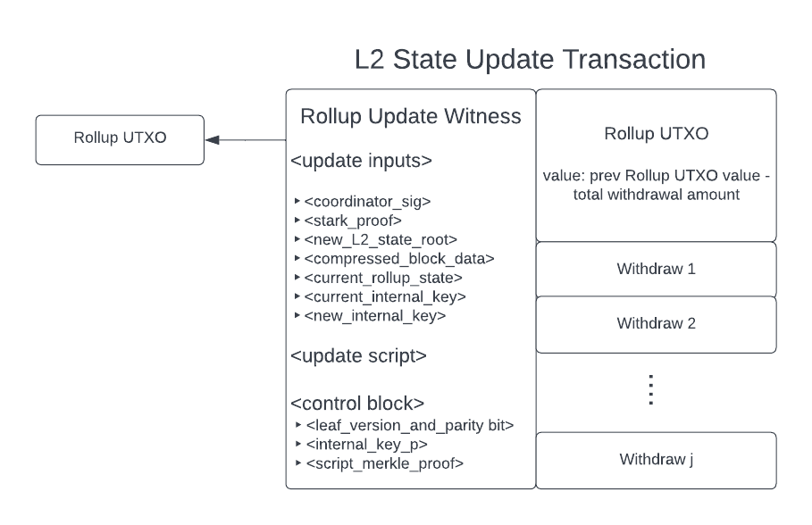
</p>

_Figure 17: The L2 State Update Transaction Witness includes the `stark_proof` that will be verified by the Rollup Protocol and `new_L2_state_root` as commitment to the L2 state. The `compressed_block_data` provide data availability such that any rollup user can recreate the L2 accounts state tree to generate a Merkle proof for their unilateral withdrawal transaction or simply to verify valid state transitions in L2._

**Update Inputs**

- `<coordinator_sig>`: The Block Producer has a private key that it uses to sign each message it broadcasts to the L1 Mempool. This signature confirms to the L1 Protocol that this message was authorized by a valid coordinator. This is 64 bytes.
- `<stark_proof>`: This is the proof received from the Prover described in Section 4.3.4.
- `<new_L2_state_root>`: This is the root of the L2 State Tree produced after transaction executor executes the transactions in the pending block. This is 32 bytes.
- `<compressed_block_data>`: This represents the state changes made by the pending block. The rollup coordinator constructs this once the pending block is executed and filtered by the transaction executor. Its construction is described in Section 4.3.1.4. It has a variable size depending on the number of transactions in the block.
- `<current_rollup_state>`: The rollup state consists of the root of the L2 State Tree, the pending deposits tree, and the deposit count, as shown in Section 4.2.3. Current L2 State Root is the root of the last confirmed L2 State Tree. The pending deposits tree and deposit count are constructed using all deposit transactions since the last L2 State Update. This is 66 bytes.
- `<current_internal_key>`: Once the current rollup state has been constructed, the current internal key can be generated using the following formula, $P = H + \textrm{int}(\textrm{hash}_{}(current\_rollup\_state))\times G$, as mentioned in Section 4.2.3. This is 32 bytes.
- `<new_internal_key>`The new rollup state is constructed using the `<new_L2_state_root>`, an empty pending deposits tree, and pending deposits count set to zero. The new internal key, as above, is calculated from the new rollup state. This is 32 bytes.

**Update Script and Control Block:**

In addition to the `<update_inputs>`, the L2 State Update witness also requires the `<update_script>` and `<control_block>`. The `<control_block>` contains a byte with leaf version (set to 0xc0 as specified in BIP 342 [84]) and parity bit (set to 1), the internal key `p`, and a `script_merkle_proof`. The `<update_script>` is a publicly known fixed script described in Section 4.2.5. The Block Producer has previously constructed the internal key while constructing the `<update_inputs>`. The `script_merkle_proof` is a series of cohashes that prove the existence of the L2 State Update script in the P2TR script tree which is already known to the Block Producer. The total size of `<control_block>` is 129 bytes.

**Transaction Outputs:**

<u>Rollup UTXO:</u> The Block producer generates the scriptPubKey for the Rollup UTXO by performing the TapTweak hash [84] with the `<new_internal_key>` and the root of the P2TR script tree, which is a known constant.

<u>Withdrawal UTXOs:</u> The Block Producer now needs to construct the list of withdrawals from the rollup that needs to be part of the outputs of State Update transaction. To do this, the Block Producer iterates over all the withdrawal transactions in the pending block and constructs an output with the requested amount and a scriptPubKey according to the user’s specification, most likely a P2PKH with the user’s L1 public key.

The Block Producer now has everything that it needs to broadcast an L2 State Update transaction in L1. When it receives the proof, the Block Producer broadcasts the State Update transaction, using as parent the last transaction in the L1 Transaction Queue. Once the L2 State Update Transaction is confirmed on L1, the Block Producer updates the last confirmed L2 State Tree and adds the pending block to the L2 blockchain. This officially marks this block as confirmed.

The following sections describe the execution of the pending block and the generation of the validity proof.

### **4.3.3 Transaction Executor**

Transaction executor module takes the pending block of transactions and the latest L2 State Tree confirmed on L1 from the Rollup Coordinator. The role of the Transaction Executor is to execute the pending block of transactions to generate new L2 State Root and an execution trace, as shown in Figure 18. The new L2 State Root is the new root of the L2 State Tree after executing the block of transactions. Execution trace is generated by executing a compiled state transition program on the VM and is passed on to the Prover module to produce a validity proof of correct execution.

<p align="center">
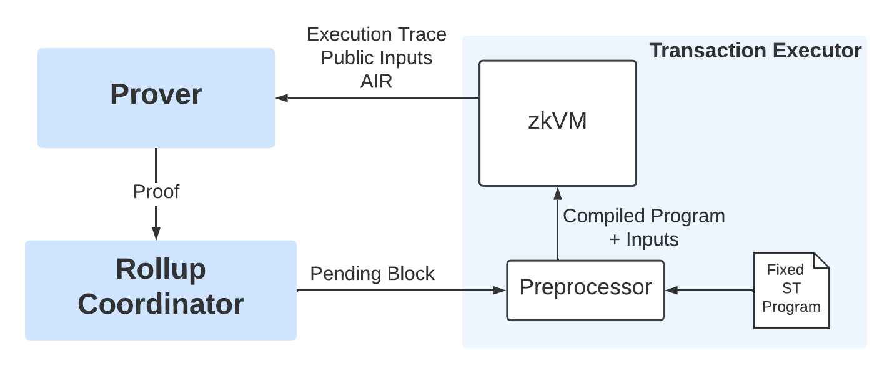
</p>

_Figure 18: Transaction Executor interacts with the Prover and the Rollup Coordinator of the L2 Rollup System to generate the execution trace of transactions in the proposed block._

**Fixed State Transition Program**

The Fixed State Transition Program is a fixed, publicly auditable program that defines the state transition rules in our L2 Rollup System. This program runs inside a VM environment on a set of transactions (called “block”), and incrementally updates the L2 State Tree as it executes the transactions in the block. Assuming a stack-based VM, the program expects the L2 State Root to be the only item on the stack at the start of execution and leaves the updated L2 State Root as the only remaining item on the stack upon completion. The program has access to the entire L2 State Tree and the pending block containing data of all transactions to be executed, which are stored in the VM environment's RAM.

Each transaction in the pending block contains the witness information (such as signatures) necessary for its execution. If a transaction fails during execution, it is removed from the pending block and the program continues executing the rest of the transactions. The updated pending block is accessible to both the Rollup Coordinator and the Transaction Executor.

**Program Logic**

1. Pop an item from the stack. Assign it as `cur_root`. Verify that the stack is now empty.
2. Load the L2 State Tree and the transaction block from pre-defined memory addresses. Verify that the root of the loaded tree is equal to `cur_root`.
3. Assign `deposits = []; withdrawals = []; rest = []`.
4. Assign `new_root = cur_root`. This variable will be updated on every transaction execution.
5. For each transaction in the block:
   1. If L1 transaction:
      1. If deposit, either create new account or add balance to a current account. Then append transaction to `deposits`.
      2. If unilateral withdrawal, subtract the appropriate balance from the given account.
   2. Else:
      1. Validate the transaction according to the `validate()` function of the sender account.
      2. Execute the transaction according to the `execute()` function of the sender account.
      3. If error during validation or execution, reject the transaction, notify the system, remove transaction from the block, and continue to next transaction.
      4. If this is withdrawal transaction, append to `withdrawals`. Else, append to `rest`.
   3. Merkle-update the L2 State Tree. Update `new_root` with the root of this new tree.
6. Using `deposits`, `withdrawals`, and `rest`, construct the compressed block data according to the structure described in Section 4.3.1.4. Assign it as `compressed_block_data`.
7. Assign `output_state = new_root + hash(bytes(compressed_block_data))`.
8. Push `output_state` to the stack and return.

**Preprocessor**

The preprocessor prepares the VM environment for the execution of the state transition program by processing inputs received from the Rollup Coordinator. This includes loading the L2 State Tree and the pending block of transactions into the designated memory addresses within RAM, which will subsequently be consumed by the state transition program. Additionally, the preprocessor initializes the stack by pushing the current L2 State Root, which is interpreted as input by the state transition program. Finally, the preprocessor compiles the state transition program into an assembly code to be executed on the VM.

**zkVM:**

zkVM, a zero-knowledge virtual machine, is a stack machine that executes the compiled state transition program over a constraint system to generate the execution trace. While a detailed design of zkVM is out of scope of this paper, in this section we describe the role of the component in the L2 Rollup System.

For specialized rollup designs that only support specific types of transactions such as payments, we do not need a general purpose VM to generate an execution trace. However, our design considers programmable transactions with expressive smart contracts. We also have flexibility in designing the L2 smart contract programming language. Therefore, we have proposed a custom zkVM in the Transaction Executor module that can execute general purpose programs and produce an execution trace.

One of the key component of a zkVM is a constraint system against which an execution trace is generated to construct a proof. Different proof systems use different arithmetizations to generate the constraint system. R1CS (Rank-1 Constraint Satisfiability), AIR (Algebraic Intermediate Representation) and Plonkish arithmetizations are some of the most commonly used techniques, as described in section 5.2.1. Therefore, we have flexibility in designing the constraint system for our zkVM and proof system. If we consider Miden VM [59], which is a stack machine that uses Goldilocks 64-bit prime field Fp, with $p = 2^{64} − 2^{32} + 1$, it uses AIR to generate the constraint system. In this VM, an execution trace is a matrix of field elements, where each columns represent registers and each row a point in time (VM cycle).

The public inputs for the execution of a program can be given to the zkVM by initializing the stack with desired inputs. The outputs can be extracted from the elements left on the stack at the end of the program execution. Once the execution trace is generated, it is sent to the Prover, along with the constraint system and public inputs, which includes program hash, initial L2 State Root and final L2 State Root, to construct the validity proof.

### **4.3.4 Prover**

The prover generates a validity proof attesting to the correctness of the execution trace produced by the zkVM. The constraint system and the proof generation protocol used by the Prover depends on the proof system used in the Rollup System. In our design, we choose FRI-based proof system that generates the proof in logarithmic time in the size of the computation. It has properties such as minimum cryptographic assumption, trustless setup and post-quantum security, which aligns with Bitcoin’s core values of decentralization and security. The details of FRI-based proof generation and verification process is explained in Section 5.4. Once the proof is generated, Prover sends the proof to the Rollup Coordinator, which then creates the L2 state update transaction on L1.

While we choose FRI-based proof system in our current Bitcoin rollup design, there is active research on this area, and we have ample flexibility to explore various different proof systems. Section 5.2 discusses in great detail various proof systems and their properties. Section 5.3 explains our rationale for picking FRI-based proof system in our first design iteration.

### **4.3.5 Tying it together**

In the prior sections, we described many components of the proposed design in detail. We now take a bird’s eye view of the entire system, including zooming into the Bitcoin layer.

<p align="center">
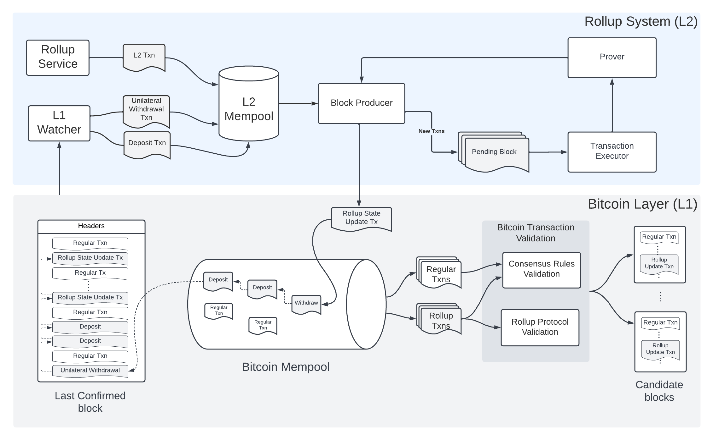
</p>

_Figure 19: The rollup system collects a batch of L2 transactions, prepares the validity proof for the batch, and broadcasts that information to the Bitcoin network through a Rollup State update transaction. This transaction builds up from the last rollup transaction in the Bitcoin (L1) Mempool. The rollup transactions go through the rollup smart contract verification in addition to consensus rules verification before ending up in the candidate blocks being worked on by the Bitcoin node._

The upper portion of the Figure 19 shows our L2 rollup system. The Rollup Service pushes into L2 Mempool the L2 transactions from the users. Similarly, the L1 watcher keeps track of the L1 Mempool, and maintains in the L2 Mempool a queue of unilateral withdrawal transactions and deposit transactions initiated in L1. The block producer takes the transactions from the L2 Mempool to create a block. It is called a pending block because it is the block being proposed for validity proof verification, but not verified yet. The pending block passes through the transaction executor and the prover, which generate the validity proof for the state transition for that block. When the validity proof is ready, the block producer packages it into a Rollup State update transaction with its parent transaction being the latest rollup transaction in the Bitcoin Mempool. This transaction then gets broadcasted to the Bitcoin network.

The lower portion of Figure 19 shows the details on the Bitcoin layer. The latest confirmed block, as well as the Bitcoin Mempool, contains various “regular” transactions along with the rollup transactions. A user creates a new rollup transaction on top of the latest rollup transaction visible to them.

Before a Bitcoin node adds the transactions to their candidate block, they go through the Bitcoin transaction validation process. For the rollup state update transaction, this involves the execution of the update script in Bitcoin Rollup Protocol, in addition to the verification of other consensus rules. Multiple nodes go through this process, generating each of their own candidate block that may include the rollup state update transaction. One of the blocks gets mined and confirmed in L1. If the mined block contains the rollup state update transaction, the pending L2 block corresponding to this transaction is also marked as confirmed.

### **4.3.6 Scalability Analysis**

The scalability analysis aims to determine the potential reduction in on-chain data size and fees as a result of executing a block of N different transactions off-chain and aggregating them into one state update transaction broadcasted to the Bitcoin layer, compared to executing each transaction individually on the Bitcoin blockchain. Four values of N are considered in our analysis: 100, 1000, 10,000, and 100,000.

The average size of a Bitcoin transaction in the past year is just over 560 vBytes [76]. The next section discusses the size of an average L2 state update transaction according to our design.

#### **4.3.6.1 Size of L2 State Update Transaction**

An L2 update transaction contains an input spending the rollup (using P2TR witness), an output paying to the rollup (using P2TR), and multiple other withdrawal outputs paying to users (assume P2WPKH). Following is the breakdown of the inputs and outputs.

**Transaction Input**

The bulk of the update transaction input contains witness items. Following are the witness items and their sizes, for different values of N (number of rolled-up transactions in that update batch).

| Witness Item          | Size (bytes) | Size (N=100) | Size (N=1K) | Size (N=10K) | Size (N=100K) |
| --------------------- | ------------ | ------------ | ----------- | ------------ | ------------- |
| stark_proof           | 50-100 KB    | 50 KB        | 75 KB       | 100 KB       | 150 KB        |
| compressed_block_data | ~66 /Tx      | 6.6 KB       | 66 KB       | 660 KB       | 6600 KB       |
| update_script         | ~10 KB       | 10 KB        | 10 KB       | 10 KB        | 10 KB         |
| control_block         | 129          | 129          | 129         | 129          | 129           |
| coordinator_sig       | 64           | 64           | 64          | 64           | 64            |
| new_L2_state_root     | 32           | 32           | 32          | 32           | 32            |
| current_rollup_state  | 66           | 66           | 66          | 66           | 66            |
| current_internal_key  | 32           | 32           | 32          | 32           | 32            |
| new_internal_key      | 32           | 32           | 32          | 32           | 32            |
| Total (bytes)         |              | 66,955       | 151,355     | 770,355      | 6,760,355     |
| Total (vBytes)        |              | 16,738.75    | 37,838.75   | 192,588.75   | 1,690,088.75  |

Proof size for STARK varies according to the number of batch transactions. We use a range of 50-150 kilobytes, which is a reasonable estimation based on latest open-source implementations[71]. The size of compressed block data per transaction is discussed in Section 4.3.1.4. We use 10 KB as the size of update script, which is ample space for a script of this nature. Control block is exactly 129 bytes. The size of rest of the witness items are discussed in Section 4.3.2.2. In a segwit transaction, size of witness items in vBytes = 1/4\* size in bytes, which is reflected in the table above.
The rest of the input fields are exactly the same as P2WSH input, totaling to the size of 41.25 vBytes. The rest of the input fields are exactly the same as P2WSH input, totaling to the size of 41.25 vBytes.

**Transaction outputs**

The first output is a standard P2TR output whose size is 43 vBytes and rest of the withdrawals outputs are assumed to be P2WPKH, each with the size of 31 vBytes. We consider the fraction of withdrawals to be 5% of the total transactions in our analysis.

**Total size**

For a batch update with N transactions (N = 1K and 10K) following are the total sizes.

| Transaction Section | vBytes (N=100) | vBytes (N=1K) | vBytes (N=10K) | vBytes (N=100K) |
| ------------------- | -------------- | ------------- | -------------- | --------------- |
| Witness items       | 16,738.75      | 37,838.75     | 192,588.75     | 1,690,088.75    |
| Other inputs        | 41.25          | 41.25         | 41.25          | 41.25           |
| Output fields       | 198            | 1593          | 15,543         | 155,043         |
| Overhead fields     | 10.5           | 10.5          | 10.5           | 10.5            |
| Total               | 16988.5        | 39483.5       | 208183.5       | 1845183.5       |

### **4.3.6.2 Scalability gain**

The scaling factor (scalability gained) represents the multiple by which the vBytes on the Bitcoin blockchain get reduced, which is equal to the reduction in the transaction fees.

We can calculate the scalability gained as:

`scaling factor = (N * avg size of one Bitcoin transaction) / size of corresponding rollup P2TR transaction`

The table below shows throughput improvement for different values of N.

| Number of Transactions (N) | vBytes with separate Bitcoin on-chain txs | vBytes with a rollup update Tx | Throughput Improvement |
| -------------------------- | ----------------------------------------- | ------------------------------ | ---------------------- |
| 100                        | 56,000                                    | 16,988.5                       | 3.3                    |
| 1000                       | 560,000                                   | 39,483.5                       | 14.18                  |
| 10,000                     | 5,600,000                                 | 208,183.5                      | 26.9                   |
| 100,000                    | 56,000,000                                | 1,845,183.5                    | 30.35                  |

As we see above, we achieve significant scalability with our rollup design. However, these are the estimates based on a simple design of compressed block data and current state-of-the-art STARK proof size, both of which will improve with further research and design iterations.

The compressed block data is the leading factor for huge rollup update transaction size for higher values of N because its size grows linearly with the number of rolled-up transactions. It could be compressed further with more sophisticated data-compression techniques [81]. In addition, there are off-chain data availability solutions being developed actively [69]. If a sufficiently secure and trustless solution is developed, our future designs could completely get rid of on-chain compressed block data for much larger throughput gains for higher values of N. For example, for 10K rolled-up transactions, with no compressed block data on-chain, the scalability factor is ~182 (instead of ~27), which is an order of magnitude better.

Similarly, the research on FRI-based proof systems is at its infancy, and the pace of research is very high. Polygon’s Plonky2, a recursive SNARK proof system based on FRI claims significant reduction in proof size [70]. As more research is done in this area, we can expect the proof sizes to decrease over time. Even at present, for rollup systems with very large transaction size, the proof size is less of a concern because it only grows poly-logarithmically with the transaction size.

In conclusion, while we see significant scalability factors with this proposed design, we can expect to get even greater improvements on these numbers in the future with more research and design iterations.

# **5 Zero Knowledge Protocols**

## **5.1 Foundations**

A mathematical proof, in a traditional sense, is a static construct based on axioms and logical deductions that can be verified step-by-step. However, the notion of proof discussed in this section is dynamic and probabilistic in nature. This dynamic interpretation of proof led to the development of what we call \textit{interactive proof (IP)}. The interaction takes place between two parties called the \textit{prover} and the \textit{verifier}. The system that defines how a \textit{prover} generates the proof and how a \textit{verifier} validates the proof is called the \textit{proof system}.

In a seminal paper, Goldwasser et.al. proposed that every interactive proof systems must satisfy two key properties [45]:

1. **Completeness:** If the prover is honest, it will eventually convince the verifier. Any true statements will have a convincing (highly probable) proof.
2. **Soundness:** The prover can only convince the verifier if the statement is true. False statements will not have a convincing proof.

Moreover, there are two notions to the definition of soundness:

1. **Statistical (informational-theoretical) soundness:** A proof system is statistically sound if soundness holds for any unbounded cheating prover.
2. **Computational soundness:** A proof system is computationally sound if soundness holds for only computationally bounded prover.

A computationally sound interactive proof system is defined as an _argument system_. This means in an argument system, a prover is polynomially-bounded and does not poses infinite computational power. In recent years, these argument systems have been used as a tool in cryptographic protocols of real-world systems. Because of their practical usage, these argument systems are often simply referred to as proof systems.

Argument systems are designed using two mathematical building blocks. The first part is an information-theoretic protocol such as interactive proof (IP), probabilistically checkable proof (PCP) or interactive oracle proof (IOP). These protocols are then combined with cryptographic techniques like polynomial commitment scheme (PCS) and Fiat-Shamir transformation to generate the argument system. The fusion of cryptography gives rise to very useful properties like non-interactivity, succinctness and zero-knowledge. An argument system with all three properties is known as zk-SNARK: Zero-knowledge-Succint Non-interactive ARgument of Knowledge.

An argument system is zero-knowledge if the prover can prove a claim to the verifier without revealing any information in the process. The verifier gains no additional information beyond just the fact that the claim is true. The notion of zero-knowledge proof was first introduced in 1985 by MIT researchers, where they gave the very first zero-knowledge proof of a well-defined problem [45].

## **5.2 Proof Systems**

The development of recent proof systems has been fueled by two fundamental problems of the decentralized blockchain: privacy and scalability. proof systems achieved privacy by shielding the inputs of the computation (zero-knowledge proofs) and scalability by generating a succinctly verifiable proof of computation. Most modern proof systems are built using polynomial IOP as the information-theoretic part and a polynomial commitment scheme as the cryptographic primitive [46]. Interactive oracle proof (IOP) is an interactive proof (IP) where the verifier does not have to read the prover’s entire message. The verifier can randomly query the prover’s messages, which are polynomials defined over a finite field. Polynomial IOP generates the polynomial constraints from the computation and the polynomial commitment scheme is used to prove that the polynomial constraints are satisfied.

In what follows, we will discuss in details the workflow of generating the proof by any polynomial IOP based proof system. Figure 20 shows key steps involved in the process.

<p align="center">
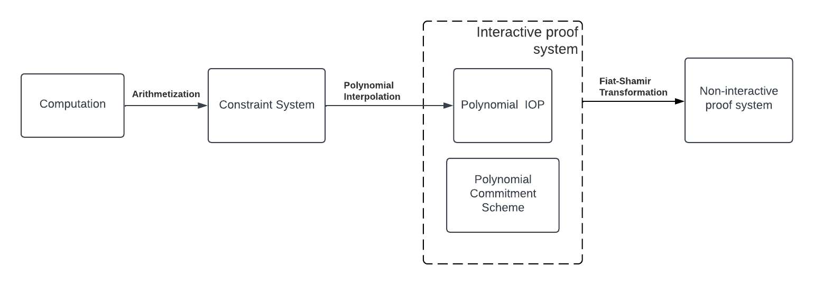
</p>

_Figure 20: The figure above shows the proof generation step in the a polynomial IOP based proof system. A computation is arithmetized to obtain a constraints system. Polynomial interpolation of the system leads to an abstract protocol we call Polynomial IOP. It is then cryptographically compiled with polynomial commitment scheme and Fiat-Shamir transformation to obtain a non-interactive proof system._

### **5.2.1 Arithmetization, Interpolation and Polynomial IOP**

As a first step, a proof system needs some way to represent the computation. Computers represent programs in machine language with operations over registers and memory and these operations are carried out in bits. However, for a proof system to generate succinct proof of computation, nice error correcting properties of polynomials can be used. In order to compute these polynomials, the computation to be proven is first converted into a system of constraints. These are basically equations with coefficients and variables defined over a finite field. This transformation of problem from the computation/circuit space to polynomial space is called the arithmetization.

There are multiple approaches to generating such constraint systems. R1CS (Rank 1 Constraint Satisfiability), AIR (Algebraic Intermediate Representation) and Plonkish arithmetization like Plonk, TurboPlonk and UltraPlonk are some of the most used methods.

Through interpolation, the system of constraints are converted into low-degree univariate polynomials that the prover can send to the verifier as part of the polynomial IOP. Verifier can then make random queries to the oracle to validate the proof. To make the proof system non-interactive and efficient, it is cryptographically compiled using polynomial commitment scheme and Fiat-Shamir transformation.

### **5.2.2 Polynomial Commitment Schemes**

Commitment schemes are the building blocks of many cryptographic protocols. A commitment scheme allows a committer to publish a value which binds the committer to the original message without revealing it. A polynomial commitment scheme allows prover to commit to a polynomial with one property: it can later be opened to show that the value of the polynomial at a certain point is equal to the claimed value.

Polynomial commitment scheme (PCS) used in the polynomial IOP based proof system defines much of its characteristics and limitations. It plays a dominant role in defining proof generating time, proof length and verification time as well as the underlying cryptographic assumption, transparency and the security of the proof system. While many polynomial commitment scheme have been developed over the last few years, below are some of the most common schemes.

1. **Kate (KZG10) PCS:** It is a polynomial commitment scheme that makes use of the elliptic curve pairings. It constructs commitments using a structured reference string (SRS), which is generated using two bilinear curves, during the initial trusted setup phase [47].
2. **IPA-based PCS:** It is a polynomial commitment scheme based on the inner product arguments [48]. The concept of the inner product argument was introduced by Bootle [et.al](http://et.al) and was later optimized on the Bulletproof paper [49]. Halo [50] and Halo2 [51] further expanded its capabilities by using different arithmetization.
3. **FRI-based PCS:** FRI is a hash function based commitment scheme that performs a low-degree check on the committed polynomials. STARK proof systems [52], Plonky2 [53] and RedShift [54] uses FRI commitment scheme for its transparent setup and proof composition.
4. **DARK PCS:** Diophantine argument of knowledge is a polynomial commitment scheme based on the groups of unknown order. The commitment scheme is used in SuperSonic proof system to create a transparent zk-SNARK protocol [55].

### **5.2.3 Non-Interactive Proof using Fiat-Shamir Transformation**

While interactive proof systems laid the foundation for modern proofs systems, they are not well suited for practical applications because of the liveliness and interactivity required for both the prover and verifier.

Fiat and Shamir in 1980s introduced a heuristic technique to convert a $\Sigma$-protocol, a public-coin interactive proof system, into a non-interactive zero-knowledge proof system [56]. $\Sigma$-protocol consists of three message exchanges between the public-coin honest verifier and the prover:

1. A commit message from the prover to the verifier.
2. A uniformly sampled challenge $e$ from the verifier to the prover.
3. An answer $f(w, r, e)$ from the prover to the verifier, where $f$ is a public function and $w$ is the witness known to only prover.

Using cryptographic hash function as a random oracle model, Fiat-Shamir transformation reduces the interactions to a single message from the prover to the verifier. Random oracle model (ROM) is a theoretical model that assumes the existence of a truly random function accessible to all parties. Most modern proof systems are polynomial IOP based and use this transformation to achieve a non-interactive protocol.

### **5.2.4 Characteristics of various proof systems**

We can categorize proof systems based on three key properties. These properties are primarily derived from the polynomial commitment scheme used in the proof system.

1. **Cryptographic assumption:** Proof systems like FRI-AIR Starks[54], Redshift[54], Fractal[61], Aurora[62] and Ligero[63], that use IOP-based polynomial commitment like FRI, Ligero and Breakdown, are based on weak cryptographic assumption of Collision-Resistant Hash Function. Halo[50], Halo2[51] and Bulletproof[49] systems assume the hardness of solving Discrete Log Problem on the elliptic curve. Similarly, proof systems like Groth16[64], Plonk[65], Sonic[66], Marlin[67] and Slonk[68] are based on stronger cryptographic assumption of the Knowledge of Exponent. In addition to these, there are proof systems like SuperSonic[55] that are based on even stronger assumptions; it assumes Groups of Unknown Order assumption.
2. **Transparency:** Proof systems like Groth16, Plonk, Sonic and Marlin, that use KZG-based polynomial commitment schemes, requires an initial trusted setup to generate parameters for proof generation and verification. The setup can be performed by a trusted party or through multi-party computation (MPC). For proof systems that use other polynomial commitment schemes, there is no need to perform a trusted setup that generates global parameters using some secrets. These proof systems generate no cryptographic toxic waste.
3. **Post-quantum security:** FRI, Ligero and Breakdown based proof systems are plausibly post-quantum secure because of their weak cryptographic assumption of Collision-Resistant Hash Function [46]. Most of the other proof systems are not post-quantum secure due to their reliance on the hardness of solving Discrete Log.

## **5.3 Proof System for Bitcoin Rollups**

The choice of a proof system for a Bitcoin Rollup requires careful consideration, since the tradeoffs must be consistent with the ecosystem’s core values around decentralization and security. The verification components of the proof system would be part of Bitcoin Core, available to scripts through a proof verification opcode, so there are implementation-level considerations as well. We summarize the core properties of a proof system and the associated verifier implementation for it to be a strong choice for use in Bitcoin.

1. **Trustless**: No additional cryptographic primitives should be introduced to Bitcoin transactions that require stronger assumptions than the existing ones required for `secp256k1` elliptic curve and the hash functions. The proof system setup should be transparent.
2. **Generalizable:** The proof system should be sufficiently general to support different rollups and applications of verifiable computation for transactions.
3. **Efficient:** The verification time should be fast without requiring additional compute resources than already required for a validator node. In addition, verification computation predictability is important. An upper bound on verification time must be enforced.
4. **Succinct**: The validity proof size should be small in the size of the computation.
5. **Backwards Compatible:** The verifier and the associated opcode should be introduced to Bitcoin through a soft fork.

Analyzing the four polynomial commitment schemes described in 5.2.2 against these properties, we found that IPA-based and FRI-based PCS are strongest amongst the choices with respect to trustlessness. While KZG10 PCS based proof system is efficient in verification time and proof size, it requires several new trust assumptions and is less generalizable. Its verifier implementation would also require adding new cryptographic primitives to Bitcoin Core, which makes it a weaker choice.

We conclude that FRI-based PCS is the strongest option to use in a proof system for Bitcoin. While IPA-based PCS could be compatible with the existing cryptographic primitives on Bitcoin, the proof verification time would be prohibitively expensive for Bitcoin validators. In comparison, FRI-based PCS allows for verification times to be on the order of milliseconds. High parallelizability of proof generation steps also allows for fast proof composition. Additionally, the proof system can be post-quantum secure, with a verifier that is generalizable, succinct, and backwards compatible.

FRI-based PCS was introduced in the first realization of a transparent proof system, called STARK[54]. While STARK used AIR (Algebraic Intermediate Representation) as the arithmetization technique, recently Plonky2 and RedShift proof systems have incorporated Plonkish arithmetization with FRI-based PCS for fast recursive proof composition. These proof systems currently require expressing computation as polynomials over a finite field with an FFT-friendly prime `p'`. Thus, for Bitcoin signature verification and related operations, the proof system must simulate finite field arithmetic of the Bitcoin `secp256k1` prime `p` in its own finite field. This results in a large execution trace, proof size, and inefficient Rollup State transition proof verification.

Recent result from Ben-Sasson et al. proposes a solution for generating STARK proof over a much larger finite field [15]. In particular Ben-Sasson et al. show that a STARK proof system can be created with the same prover and verifier asymptotic complexity without needing to use an FFT-friendly prime `p'`. This enables operations for `secp256k1` signature verification in the L2 state transition function to be expressed succinctly within the execution trace. Using this new STARK construction could lead to significantly optimizations in proving time, proof size, and verification time.

## **5.4 FRI-based Proof System**

Fast Reed-Solomon IOP of Proximity (FRI) is a low-degree testing protocol that tests whether a given function is a polynomial of some bounded degree. Since FRI is based on Reed-Solomon codewords, low-degree testing of polynomial means checking if a given codeword belongs to a polynomial of low degree.

FRI-based argument systems are often referred to as STARKS, which stand for Scalable Transparent ARgument of Knowledge. It is an argument system with two key properties [52]:

1. **Scalability**: It constitutes a scalable prover that can generate proof at a running time that is at most quasilinear in the size of the computation and a scalable verifier that can verify the proof at a poly-logarithmic running time.
2. **Transparency**: There is no need to perform a trusted setup that generates global parameters using some secrets. The proof system generates no cryptographic toxic waste.

## **5.4.2 Arithmetization and Interpolation**

All proof systems begin by arithmetization of the computation to be proven. There are multiple approaches to arithmetization. Plonky2 uses Plonkish arithmetization while FRI-AIR STARK uses Arithmetic Intermediate Representation (AIR). The result of arithmetization is the construction of an arithmetic constraint system [57]. The arithmetic constraint system and the algebraic execution trace of the computation are interpolated to generate constraint polynomials and trace polynomials. The computation was executed correctly if the execution trace satisfies the constraint system or equivalently, if the committed low-degree polynomials, generated through interpolation, are in-fact low-degree polynomials. We transformed our problem from checking the validity of the computation to low-degree testing of polynomials.

## **5.4.3 Low-degree testing**

Given a function,

$$
f : D → F
$$

defined over a smooth multiplicative subgroup $D$ of a finite field $F$ (FFT-friendly domain), FRI protocol proves that $f$ is a polynomial of degree less than $d$, where $d$ is the degree bound constrained by $d < |D|$.

A naive approach to low-degree testing is to simply evaluate the function $f$ at $d+1$ points. This stems from the fact that any polynomial of degree less than $d$ is fully defined by its values at unique $d$ points in $F$. The test then simply checks

$$
h(z) == f(z)
$$

where $h$ is the polynomial interpolated using the $d$-point evaluations of $f$ and $z$ is another random point in $F$. However, since the degree $d$ is very large in practice, evaluating $d+1$ queries would be too expensive. FRI protocol solves this problem by combining two fundamental ideas.

First idea is to have prover and verifier interact with each other without any trust assumptions. A prover can allow a verifier to make queries to polynomials at verifier’s chosen points. However a verifier only makes queries on polynomial commitments, which prevents prover from altering polynomial after receiving the queries. Consider two functions $m(x)$ and $n(x)$ of degree less than $d$ and defined over domain $L$. Naive low-degree testing would require $2(d+1)$ evaluations to prove $m(x)$ and $n(x)$ are polynomials of degree less than $d$.

In a different approach, prover first commits polynomial evaluations: $\{m(x)\}|_{x \in L}$ and $\{n(x)\}|_{x \in L}$. The verifier then selects a random number $\beta$ in $L$, and sends it to the prover. Prover then commits evaluations of

$$
k(x) = m(x) + \beta n(x)
$$

on the domain $L$. Verifier can now simply check that $k(x)$ has degree less than $d$ using only $d+1$ evaluations. While this does not guarantee that the polynomial $k(x)$ will have degree less than $d$, the error is however negligible for large field $F$.

Second idea is to split a polynomial of degree less than $d$ into two polynomial of degree less than $d/2$. Using the first idea, this means in one step we have halved the number of queries. Consider the function $f$ defined above in step 0,

$$
f_0(x) = a_0 + a_1x + a_2x^2 + ….+ a_dx^d
$$

Let $h_0(x)$ and $g_0(x)$ be two functions corresponding to even and odd coefficients of the polynomial $f_0(x)$ respectively.

$$
g_0(x) = a_0 + a_2x^2 + a_4x^4 + …
= \sum_{i=0}^{\frac {d+1}{2} - 1}{}a_{2i} x^{2i}
$$

$$
h_0(x) = a_1 + a_3x + a_5x^2 + … = \sum_{i=0}^{\frac {d+1}{2} - 1}{}a_{2i + 1} x^{2i}
$$

where $\frac{d+1}{2}-1$ is the number of odd or even terms in a $d$-degree polynomials. It follows,

$$
f_0(x) = g_0(x^2) + xh_0(x^2)
$$

The verifier samples a random value $\alpha_0$ and sends it to the prover. The prover then commits to the polynomial

$$
f_1(x) = g_0(x) + \alpha_0 h_0(x)
$$

where $f_1(x)$ is now of degree less than $d/2$ and is defined over $D' = \{x^2: x \in D \}$. Since at each step the degree is halved, repeating this step $\log_2(d)$ times gives us a final constant polynomial. In order to verify that the prover did not cheat, verifier queries $f_0(z)$ and $f_0(-z)$ at a random sample $z \in D$. Using these two evaluations, verifier can reproduce $g_o(z^2)$ and $h_0(z^2)$ since,

$$
g_0(x^2) = \frac {f_0(x) + f_o(-x)}{2}
$$

$$
h_0(x^2) = \frac {f_0(x) - f_0(-x)}{2x}
$$

Thus after logarithmic queries in the size of $d$, verifier can verify the low-degree claim of the polynomial $f(x)$ of degree less than $d$.

## **5.4.4 FRI polynomial Commitment Scheme**

How is the low-degree testing protocol of FRI converted into a polynomial commitment scheme? Consider a case where a verifier asks prover the evaluation of a committed polynomial $f(X)$ in a given point $z$. The prover claims that $f(z) = y$. Assuming the claim is true, it means $f(X) - y$ must be divisible by $X - z$. The prover can then prove the low-degree of the quotient polynomial:

$$
\frac {f(X) - y}{X - z}
$$

However, if the prover was cheating, then he won’t be able to prove that the quotient polynomial has degree at most $d-1$ since $f(X) - y$ won’t be divisible.

## **5.4.5 Prover-Verifier Interaction**

In the first step of proving the computation, the prover sends the commitments of trace polynomial, composition polynomial and intermediate polynomials of FRI protocol to the verifier. Composition polynomial is a random linear combinations of constraint (boundary and transition) polynomials. The commitments are Merkle root of the evaluation of polynomials in respective domains.

In second step, the verifier makes some random queries. Prover sends the Merkle leafs (polynomial evaluations) and authentication paths against those queries to prove low-degree of polynomials. This interactive proof system is transformed into a non-interactive proof system through Fiat-Shamir transformation.

# **6 Conclusion**

We propose a Layer 2 on Bitcoin which uses a zero-knowledge proof system to add scalability and expressibility to bitcoin transactions without introducing execution complexity on Bitcoin. Our proposed Layer 2 is a ZK Rollup that provides users full ownership, control, and the ability to withdraw funds without requiring any additional trust assumptions beyond those already required by Bitcoin. Our general construction enables many new decentralized financial application for bitcoins that are secured by the Bitcoin consensus protocol.

Our ZK Rollup is secured by a rollup protocol on Bitcoin implemented as a smart contract script inside a P2TR UTXO. We enable the rollup protocol to store state in a novel way within a Taproot address and describe the scripts to verify deposits, withdrawals, and state updates. Our script spending paths are embedded within a Taproot Script Tree, and we use opcodes available in the Elements platform to enable the Rollup UTXO to enforce a recursive convenant. We presented the design for a simple Layer 2 Rollup System capable of handling P2P payments on top of the Bitcoin Rollup Protocol. Finally, we discussed different validity proof systems in the literature and presented our recommendations on the systems suitable for Bitcoin based on their alignment with Bitcoin values. While our current design requires a few changes to Bitcoin Core, such as additional Tapscript opcodes, we believe this is a compelling direction to improve Bitcoin infrastructure without sacrificing decentralization and security of the Bitcoin blockchain.

# 7 References

<Introduction>

[1] [https://bitcoin.org/bitcoin.pdf](https://bitcoin.org/bitcoin.pdf)

[2] [https://blockstream.com/bitcoin17-final41.pdf](https://blockstream.com/bitcoin17-final41.pdf)

[3] [https://stablesats.com/](https://stablesats.com/)

[4] [https://www.coinbase.com/vault](https://www.coinbase.com/vault)

[5] [https://www.sovryn.app/](https://www.sovryn.app/)

[6] [https://www.cylab.cmu.edu/\_files/documents/towards-understanding-cryptocurrency.pdf](https://www.cylab.cmu.edu/_files/documents/towards-understanding-cryptocurrency.pdf)

[7] [https://www.wired.com/2014/03/bitcoin-exchange/](https://www.wired.com/2014/03/bitcoin-exchange/)

[8] [https://www.theguardian.com/technology/2022/nov/19/the-money-is-gone-people-who-lost-out-in-ftxs-collapse](https://www.theguardian.com/technology/2022/nov/19/the-money-is-gone-people-who-lost-out-in-ftxs-collapse)

[9] [https://decrypt.co/111550/new-tool-shows-how-much-users-lost-celsius-bankruptcy](https://decrypt.co/111550/new-tool-shows-how-much-users-lost-celsius-bankruptcy)

[10] [https://www.forbes.com/sites/qai/2022/11/28/blockfi-goes-bust-as-ftx-fallout-continues/?sh=5dd49c4045e6](https://www.forbes.com/sites/qai/2022/11/28/blockfi-goes-bust-as-ftx-fallout-continues/?sh=5dd49c4045e6)

[11] [https://wbtc.network/](https://wbtc.network/)

[12] [https://liquid.net/](https://liquid.net/)

[13] [https://cointelegraph.com/news/report-half-of-all-defi-exploits-are-cross-bridge-hacks](https://cointelegraph.com/news/report-half-of-all-defi-exploits-are-cross-bridge-hacks)

[14] [https://eprint.iacr.org/2018/046.pdf](https://eprint.iacr.org/2018/046.pdf)

[15] [https://eccc.weizmann.ac.il/report/2022/110/](https://eccc.weizmann.ac.il/report/2022/110/)

[16] [https://bitcointalk.org/index.php?topic=277389.0](https://bitcointalk.org/index.php?topic=277389.0)

[17] [https://a16z.com/2022/04/15/zero-knowledge-proofs-hardware-decentralization-innovation/](https://a16z.com/2022/04/15/zero-knowledge-proofs-hardware-decentralization-innovation/)

[18] [https://lightning.network/lightning-network-paper.pdf](https://lightning.network/lightning-network-paper.pdf)

[19] [https://lists.linuxfoundation.org/pipermail/bitcoin-dev/2013-April/002417.html](https://lists.linuxfoundation.org/pipermail/bitcoin-dev/2013-April/002417.html)

[20] [https://bitcointalk.org/index.php?topic=244656.0](https://bitcointalk.org/index.php?topic=244656.0)

[21] [https://link.springer.com/chapter/10.1007/978-3-662-64331-0_9](https://link.springer.com/chapter/10.1007/978-3-662-64331-0_9)

[22] [https://github.com/t-bast/lightning-docs/blob/master/pinning-attacks.md](https://github.com/t-bast/lightning-docs/blob/master/pinning-attacks.md)

[23] [https://arxiv.org/abs/1912.09555](https://arxiv.org/abs/1912.09555)

[24] [https://bitcoinmagazine.com/business/the-state-of-lightning-network-adoption](https://bitcoinmagazine.com/business/the-state-of-lightning-network-adoption)

[25] [https://blockstream.com/sidechains.pdf](https://blockstream.com/sidechains.pdf)

[26] [https://blockstream.com/assets/downloads/pdf/liquid-whitepaper.pdf](https://blockstream.com/assets/downloads/pdf/liquid-whitepaper.pdf)

[27] [https://developers.rsk.co/rsk/architecture/powpeg/](https://developers.rsk.co/rsk/architecture/powpeg/)

[28] [https://rootstock.io/rsk-white-paper-updated.pdf](https://rootstock.io/rsk-white-paper-updated.pdf)

[29] [https://www.drivechain.info/](https://www.drivechain.info/)

[30] [https://github.com/bitcoin/bips/blob/master/bip-0300.mediawiki](https://github.com/bitcoin/bips/blob/master/bip-0300.mediawiki)

[31] [https://github.com/bitcoin/bips/blob/master/bip-0301.mediawiki](https://github.com/bitcoin/bips/blob/master/bip-0301.mediawiki)

[32] [https://www.theblock.co/post/186326/wrapped-tokens-issued-by-ftx-or-alameda-collapsing-no-longer-redeemable](https://www.theblock.co/post/186326/wrapped-tokens-issued-by-ftx-or-alameda-collapsing-no-longer-redeemable)

[33] [https://uniswap.org/whitepaper-v3.pdf](https://uniswap.org/whitepaper-v3.pdf)

[34] [https://github.com/aave/aave-protocol/blob/master/docs/Aave_Protocol_Whitepaper_v1_0.pdf](https://github.com/aave/aave-protocol/blob/master/docs/Aave_Protocol_Whitepaper_v1_0.pdf)

[35] [https://blog.ethereum.org/2014/09/17/scalability-part-1-building-top](https://blog.ethereum.org/2014/09/17/scalability-part-1-building-top)

[36] [https://github.com/OffchainLabs/nitro/blob/master/docs/Nitro-whitepaper.pdf](https://github.com/OffchainLabs/nitro/blob/master/docs/Nitro-whitepaper.pdf)

[37] [https://github.com/ethereum-optimism/optimism/blob/develop/specs/introduction.md](https://github.com/ethereum-optimism/optimism/blob/develop/specs/introduction.md)

[38] [https://github.com/barryWhiteHat/roll_up](https://github.com/barryWhiteHat/roll_up)

[39] [https://loopring.org/#/about](https://loopring.org/#/about)

[40] [https://starknet.io/](https://starknet.io/)

[41] [https://blog.matter-labs.io/zksync-2-0-hello-ethereum-ca48588de179](https://blog.matter-labs.io/zksync-2-0-hello-ethereum-ca48588de179)

[42] [https://polygon.technology/blog/polygon-announces-the-worlds-first-zero-knowledge-zk-scaling-solution-fully-compatible-with-ethereum](https://polygon.technology/blog/polygon-announces-the-worlds-first-zero-knowledge-zk-scaling-solution-fully-compatible-with-ethereum)

[43] [https://bitcoinrollups.org/](https://bitcoinrollups.org/)

[44] [https://tr3y.io/articles/crypto/bitcoin-zk-rollups.html](https://tr3y.io/articles/crypto/bitcoin-zk-rollups.html)

[45] [https://people.csail.mit.edu/silvio/Selected Scientific Papers/Proof Systems/The_Knowledge_Complexity_Of_Interactive_Proof_Systems.pdf](https://people.csail.mit.edu/silvio/Selected%20Scientific%20Papers/Proof%20Systems/The_Knowledge_Complexity_Of_Interactive_Proof_Systems.pdf)

[46] [https://people.cs.georgetown.edu/jthaler/ProofsArgsAndZK.pdf](https://people.cs.georgetown.edu/jthaler/ProofsArgsAndZK.pdf)

[47] [https://cacr.uwaterloo.ca/techreports/2010/cacr2010-10.pdf](https://cacr.uwaterloo.ca/techreports/2010/cacr2010-10.pdf)

[48] [https://eprint.iacr.org/2016/263](https://eprint.iacr.org/2016/263)

[49] [https://eprint.iacr.org/2017/1066.pdf](https://eprint.iacr.org/2017/1066.pdf)

[50] [https://eprint.iacr.org/2019/1021.pdf](https://eprint.iacr.org/2019/1021.pdf)

[51] [https://zcash.github.io/halo2/concepts/proofs.html](https://zcash.github.io/halo2/concepts/proofs.html)

[52] [https://eprint.iacr.org/2018/046.pdf](https://eprint.iacr.org/2018/046.pdf)

[53] [https://github.com/mir-protocol/plonky2/blob/main/plonky2/plonky2.pdf](https://github.com/mir-protocol/plonky2/blob/main/plonky2/plonky2.pdf)

[54] [https://eprint.iacr.org/2019/1400.pdf](https://eprint.iacr.org/2019/1400.pdf)

[55] [https://eprint.iacr.org/2019/1229.pdf](https://eprint.iacr.org/2019/1229.pdf)

[56] [https://link.springer.com/chapter/10.1007/3-540-47721-7_12](https://link.springer.com/chapter/10.1007/3-540-47721-7_12)

[57] [https://aszepieniec.github.io/stark-anatomy/overview](https://aszepieniec.github.io/stark-anatomy/overview)

[58] [https://blog.blockstream.com/en-covenants-in-elements-alpha/](https://blog.blockstream.com/en-covenants-in-elements-alpha/)

[59] [https://wiki.polygon.technology/docs/miden/intro/main](https://wiki.polygon.technology/docs/miden/intro/main)

[60] [https://ethresear.ch/t/miden-vm-v0-2-new-vm-architecture-for-a-zk-rollup/13405](https://ethresear.ch/t/miden-vm-v0-2-new-vm-architecture-for-a-zk-rollup/13405)

[61] [https://eprint.iacr.org/2019/1076.pdf](https://eprint.iacr.org/2019/1076.pdf)

[62] [https://eprint.iacr.org/2018/828.pdf](https://eprint.iacr.org/2018/828.pdf)

[63] [https://acmccs.github.io/papers/p2087-amesA.pdf](https://acmccs.github.io/papers/p2087-amesA.pdf)

[64] [https://eprint.iacr.org/2016/260.pdf](https://eprint.iacr.org/2016/260.pdf)

[65] [https://eprint.iacr.org/2019/953.pdf](https://eprint.iacr.org/2019/953.pdf)

[66] [https://eprint.iacr.org/2019/099.pdf](https://eprint.iacr.org/2019/099.pdf)

[67] [https://eprint.iacr.org/2019/1047.pdf](https://eprint.iacr.org/2019/1047.pdf)

[68] [https://ethresear.ch/t/slonk-a-simple-universal-snark/6420](https://ethresear.ch/t/slonk-a-simple-universal-snark/6420)

[69] [https://ethereum.org/en/developers/docs/scaling/validium/](https://ethereum.org/en/developers/docs/scaling/validium/)

[70] [https://polygon.technology/blog/introducing-plonky2](https://polygon.technology/blog/introducing-plonky2)

[71] [https://github.com/facebook/winterfell](https://github.com/facebook/winterfell)

[72] [https://github.com/bitcoin/bips/blob/master/bip-0341.mediawiki](https://github.com/bitcoin/bips/blob/master/bip-0341.mediawiki)

[73] [https://vitalik.ca/general/2019/12/26/mvb.html](https://vitalik.ca/general/2019/12/26/mvb.html)

[74] [https://github.com/opentimestamps/opentimestamps-server/blob/master/doc/merkle-mountain-range.md](https://github.com/opentimestamps/opentimestamps-server/blob/master/doc/merkle-mountain-range.md)

[75] [https://elementsproject.org/](https://elementsproject.org/)

[76] [https://transactionfee.info/charts/transactions-sizes/](https://transactionfee.info/charts/transactions-sizes/)

[77] [https://github.com/ElementsProject/elements/blob/master/doc/tapscript_opcodes.md](https://github.com/ElementsProject/elements/blob/master/doc/tapscript_opcodes.md)

[78] [https://github.com/bitcoin/bips/blob/master/bip-0342.mediawiki](https://github.com/bitcoin/bips/blob/master/bip-0342.mediawiki)

[79] [https://eips.ethereum.org/EIPS/eip-4337](https://eips.ethereum.org/EIPS/eip-4337)

[80] [https://docs.starknet.io/documentation/architecture_and_concepts/Account_Abstraction/introduction/](https://docs.starknet.io/documentation/architecture_and_concepts/Account_Abstraction/introduction/)

[81] [https://arxiv.org/pdf/2108.05513.pdf）](https://arxiv.org/pdf/2108.05513.pdf%EF%BC%89)

[82] [https://www.ripublication.com/ijaer17/ijaerv12n19_128.pdf](https://www.ripublication.com/ijaer17/ijaerv12n19_128.pdf)

[83] [https://gz.blockchair.com/ethereum/transactions/](https://gz.blockchair.com/ethereum/transactions/)
